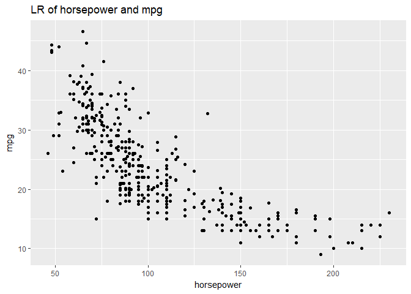
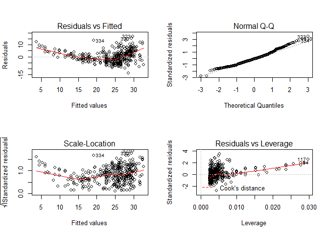
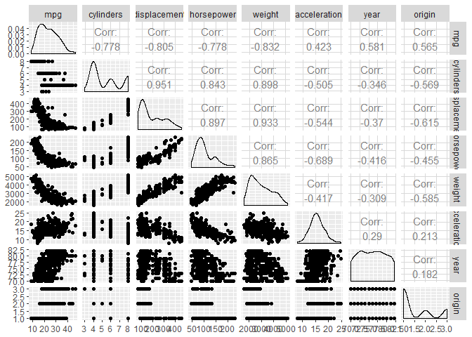
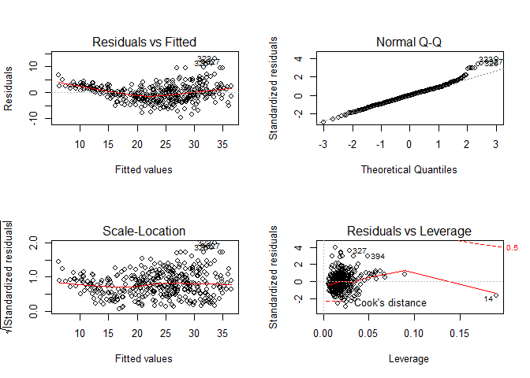

ch3\_exercises
================
Christoper Chan
November 23, 2018

Chapter 3 Exercises
===================

Conceptual
----------

### 1

The null hypothesis is that advertising on TV, radio and newspaper contribute a equal amount to changes in sales. The alternative hypothesis is that this is not true, that in fact at least one of the following: TV, radio and newspaper advertising contribute an non-zero amount to sales. Based on Table 3.4 TV and radio advertising have p-values less than 0.0001, meaning that their coefficients are statistically significant. This implies that their impact is real, and based on their non-negative cofficients, that an increase in spending on TV and radio advertising brings a positive increase in units sold. The large p-value for newspaper implies that it is not significant and does not contribute to sales.

### 2

KNN classifiers return a qualitative value while KNN regression returns a quantitative value, of f(x).

### 3

1.  iii
2.  137.1
3.  False, depends on the p-value.

Applied
-------

### 8

1.  

``` r
library(ISLR)
library(MASS)
library(tidyverse)
library(GGally)

summary(Auto)
```

    ##       mpg          cylinders      displacement     horsepower   
    ##  Min.   : 9.00   Min.   :3.000   Min.   : 68.0   Min.   : 46.0  
    ##  1st Qu.:17.00   1st Qu.:4.000   1st Qu.:105.0   1st Qu.: 75.0  
    ##  Median :22.75   Median :4.000   Median :151.0   Median : 93.5  
    ##  Mean   :23.45   Mean   :5.472   Mean   :194.4   Mean   :104.5  
    ##  3rd Qu.:29.00   3rd Qu.:8.000   3rd Qu.:275.8   3rd Qu.:126.0  
    ##  Max.   :46.60   Max.   :8.000   Max.   :455.0   Max.   :230.0  
    ##                                                                 
    ##      weight      acceleration        year           origin     
    ##  Min.   :1613   Min.   : 8.00   Min.   :70.00   Min.   :1.000  
    ##  1st Qu.:2225   1st Qu.:13.78   1st Qu.:73.00   1st Qu.:1.000  
    ##  Median :2804   Median :15.50   Median :76.00   Median :1.000  
    ##  Mean   :2978   Mean   :15.54   Mean   :75.98   Mean   :1.577  
    ##  3rd Qu.:3615   3rd Qu.:17.02   3rd Qu.:79.00   3rd Qu.:2.000  
    ##  Max.   :5140   Max.   :24.80   Max.   :82.00   Max.   :3.000  
    ##                                                                
    ##                  name    
    ##  amc matador       :  5  
    ##  ford pinto        :  5  
    ##  toyota corolla    :  5  
    ##  amc gremlin       :  4  
    ##  amc hornet        :  4  
    ##  chevrolet chevette:  4  
    ##  (Other)           :365

``` r
fit_auto <- lm(mpg~horsepower, data=Auto)
summary(fit_auto)
```

    ## 
    ## Call:
    ## lm(formula = mpg ~ horsepower, data = Auto)
    ## 
    ## Residuals:
    ##      Min       1Q   Median       3Q      Max 
    ## -13.5710  -3.2592  -0.3435   2.7630  16.9240 
    ## 
    ## Coefficients:
    ##              Estimate Std. Error t value Pr(>|t|)    
    ## (Intercept) 39.935861   0.717499   55.66   <2e-16 ***
    ## horsepower  -0.157845   0.006446  -24.49   <2e-16 ***
    ## ---
    ## Signif. codes:  0 '***' 0.001 '**' 0.01 '*' 0.05 '.' 0.1 ' ' 1
    ## 
    ## Residual standard error: 4.906 on 390 degrees of freedom
    ## Multiple R-squared:  0.6059, Adjusted R-squared:  0.6049 
    ## F-statistic: 599.7 on 1 and 390 DF,  p-value: < 2.2e-16

1.  Yes, there is a relationship between mpg and horsepower. This is indicated by the F-statistic that is close to zero. That means we can reject the null hypothesis, that there is no relationship between mpg and horsepower.
2.  The residual standard error (RSE) will tell us the quality of the relationship between mpg and horsepower. Because the RSE is 4.906 for 390 DF and the mean for mpg is 23.45, the RSE is 20.9211087%.The adjusted  is 0.6049, meaning that 60.49% of the variance in mpg can be explained by the horsepower.
3.  The relationship between mpg and horsepower is negative, given by the negative slope horsepower.
4.  

``` r
predict(fit_auto, data.frame(horsepower=c(98)), interval = 'confidence')
```

    ##        fit      lwr      upr
    ## 1 24.46708 23.97308 24.96108

``` r
predict(fit_auto, data.frame(horsepower=c(98)), interval = 'prediction')
```

    ##        fit     lwr      upr
    ## 1 24.46708 14.8094 34.12476

1.  

``` r
ggplot(Auto, aes(horsepower, mpg)) +
  geom_point() +
  labs(title='LR of horsepower and mpg')
```



``` r
  geom_abline(intercept=39.936, slope=-0.158, color='#E41A1C')
```

    ## mapping: intercept = intercept, slope = slope 
    ## geom_abline: na.rm = FALSE
    ## stat_identity: na.rm = FALSE
    ## position_identity

1.  

``` r
par(mfrow=c(2,2))
plot(fit_auto)
```

 Plot 1 has a slight curve to it, with most of the points concentrated around 20-30. However, in plot 3 the mean line is roughly linear. Points roughly follow the line for the Normal Q-Q plot and few points are outliers, shown in plot 4.

### 9

1.  

``` r
dim(Auto)
```

    ## [1] 392   9

``` r
data(Auto)
ggpairs(Auto, columns = 1:8)
```



1.  

``` r
cor(Auto[,1:8])
```

    ##                     mpg  cylinders displacement horsepower     weight
    ## mpg           1.0000000 -0.7776175   -0.8051269 -0.7784268 -0.8322442
    ## cylinders    -0.7776175  1.0000000    0.9508233  0.8429834  0.8975273
    ## displacement -0.8051269  0.9508233    1.0000000  0.8972570  0.9329944
    ## horsepower   -0.7784268  0.8429834    0.8972570  1.0000000  0.8645377
    ## weight       -0.8322442  0.8975273    0.9329944  0.8645377  1.0000000
    ## acceleration  0.4233285 -0.5046834   -0.5438005 -0.6891955 -0.4168392
    ## year          0.5805410 -0.3456474   -0.3698552 -0.4163615 -0.3091199
    ## origin        0.5652088 -0.5689316   -0.6145351 -0.4551715 -0.5850054
    ##              acceleration       year     origin
    ## mpg             0.4233285  0.5805410  0.5652088
    ## cylinders      -0.5046834 -0.3456474 -0.5689316
    ## displacement   -0.5438005 -0.3698552 -0.6145351
    ## horsepower     -0.6891955 -0.4163615 -0.4551715
    ## weight         -0.4168392 -0.3091199 -0.5850054
    ## acceleration    1.0000000  0.2903161  0.2127458
    ## year            0.2903161  1.0000000  0.1815277
    ## origin          0.2127458  0.1815277  1.0000000

1.  

``` r
fit_auto9 <- lm(mpg~.-name, Auto)
summary(fit_auto9)
```

    ## 
    ## Call:
    ## lm(formula = mpg ~ . - name, data = Auto)
    ## 
    ## Residuals:
    ##     Min      1Q  Median      3Q     Max 
    ## -9.5903 -2.1565 -0.1169  1.8690 13.0604 
    ## 
    ## Coefficients:
    ##                Estimate Std. Error t value Pr(>|t|)    
    ## (Intercept)  -17.218435   4.644294  -3.707  0.00024 ***
    ## cylinders     -0.493376   0.323282  -1.526  0.12780    
    ## displacement   0.019896   0.007515   2.647  0.00844 ** 
    ## horsepower    -0.016951   0.013787  -1.230  0.21963    
    ## weight        -0.006474   0.000652  -9.929  < 2e-16 ***
    ## acceleration   0.080576   0.098845   0.815  0.41548    
    ## year           0.750773   0.050973  14.729  < 2e-16 ***
    ## origin         1.426141   0.278136   5.127 4.67e-07 ***
    ## ---
    ## Signif. codes:  0 '***' 0.001 '**' 0.01 '*' 0.05 '.' 0.1 ' ' 1
    ## 
    ## Residual standard error: 3.328 on 384 degrees of freedom
    ## Multiple R-squared:  0.8215, Adjusted R-squared:  0.8182 
    ## F-statistic: 252.4 on 7 and 384 DF,  p-value: < 2.2e-16

1.  Yes, this is given by the near zeor p-value for the F-statistic.
2.  There is a relationship for mpg and the following predictor variables: displacement, weight, year, origin.
3.  The relatively large coefficient for preditor variable year and the low p-value indicates that there it has a large effect.

<!-- -->

1.  

``` r
par(mfrow=c(2,2))
plot(fit_auto9)
```

 The residual plot shows a number of outliers at the higher fitted value. On the leverage plot point 14 has a disprportionate amount of leverage.

### 10

1.  

``` r
fit_seats <- lm(Sales~Price + Urban + US, data=Carseats)
summary(fit_seats)
```

    ## 
    ## Call:
    ## lm(formula = Sales ~ Price + Urban + US, data = Carseats)
    ## 
    ## Residuals:
    ##     Min      1Q  Median      3Q     Max 
    ## -6.9206 -1.6220 -0.0564  1.5786  7.0581 
    ## 
    ## Coefficients:
    ##              Estimate Std. Error t value Pr(>|t|)    
    ## (Intercept) 13.043469   0.651012  20.036  < 2e-16 ***
    ## Price       -0.054459   0.005242 -10.389  < 2e-16 ***
    ## UrbanYes    -0.021916   0.271650  -0.081    0.936    
    ## USYes        1.200573   0.259042   4.635 4.86e-06 ***
    ## ---
    ## Signif. codes:  0 '***' 0.001 '**' 0.01 '*' 0.05 '.' 0.1 ' ' 1
    ## 
    ## Residual standard error: 2.472 on 396 degrees of freedom
    ## Multiple R-squared:  0.2393, Adjusted R-squared:  0.2335 
    ## F-statistic: 41.52 on 3 and 396 DF,  p-value: < 2.2e-16

1.  Price is statistically significant, with a negative relationship between price and sales. USYes is also statistically significant, indicating a positive relationship between being in the US and sales.

2.  *\beta_2")
3.  Price and USYes are the only predictors whose null hypothesis can be rejected.
4.  

``` r
data(Auto)
fit_seats_real <- lm(Sales~Price + US, data=Carseats)
summary(fit_seats_real)
```

    ## 
    ## Call:
    ## lm(formula = Sales ~ Price + US, data = Carseats)
    ## 
    ## Residuals:
    ##     Min      1Q  Median      3Q     Max 
    ## -6.9269 -1.6286 -0.0574  1.5766  7.0515 
    ## 
    ## Coefficients:
    ##             Estimate Std. Error t value Pr(>|t|)    
    ## (Intercept) 13.03079    0.63098  20.652  < 2e-16 ***
    ## Price       -0.05448    0.00523 -10.416  < 2e-16 ***
    ## USYes        1.19964    0.25846   4.641 4.71e-06 ***
    ## ---
    ## Signif. codes:  0 '***' 0.001 '**' 0.01 '*' 0.05 '.' 0.1 ' ' 1
    ## 
    ## Residual standard error: 2.469 on 397 degrees of freedom
    ## Multiple R-squared:  0.2393, Adjusted R-squared:  0.2354 
    ## F-statistic: 62.43 on 2 and 397 DF,  p-value: < 2.2e-16

1.  Both models, from part (a) and (e), fit the data reasonably well. This is based on the RSE and , with the model from part (e) fitting the data slightly better.

2.  

``` r
confint(fit_seats_real)
```

    ##                   2.5 %      97.5 %
    ## (Intercept) 11.79032020 14.27126531
    ## Price       -0.06475984 -0.04419543
    ## USYes        0.69151957  1.70776632

1.
