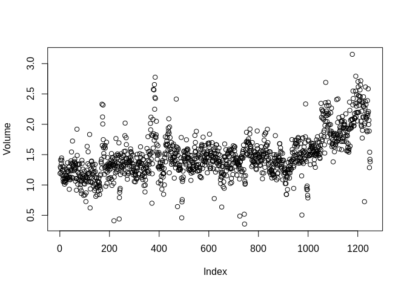

ch4\_labs
================
Christopher Chan
January 8, 2019

``` r
library(tidyverse)
library(ISLR)
```

4.6.1
-----

``` r
dim(Smarket)
```

    ## [1] 1250    9

``` r
head(Smarket)
```

    ##   Year   Lag1   Lag2   Lag3   Lag4   Lag5 Volume  Today Direction
    ## 1 2001  0.381 -0.192 -2.624 -1.055  5.010 1.1913  0.959        Up
    ## 2 2001  0.959  0.381 -0.192 -2.624 -1.055 1.2965  1.032        Up
    ## 3 2001  1.032  0.959  0.381 -0.192 -2.624 1.4112 -0.623      Down
    ## 4 2001 -0.623  1.032  0.959  0.381 -0.192 1.2760  0.614        Up
    ## 5 2001  0.614 -0.623  1.032  0.959  0.381 1.2057  0.213        Up
    ## 6 2001  0.213  0.614 -0.623  1.032  0.959 1.3491  1.392        Up

``` r
summary(Smarket)
```

    ##       Year           Lag1                Lag2          
    ##  Min.   :2001   Min.   :-4.922000   Min.   :-4.922000  
    ##  1st Qu.:2002   1st Qu.:-0.639500   1st Qu.:-0.639500  
    ##  Median :2003   Median : 0.039000   Median : 0.039000  
    ##  Mean   :2003   Mean   : 0.003834   Mean   : 0.003919  
    ##  3rd Qu.:2004   3rd Qu.: 0.596750   3rd Qu.: 0.596750  
    ##  Max.   :2005   Max.   : 5.733000   Max.   : 5.733000  
    ##       Lag3                Lag4                Lag5         
    ##  Min.   :-4.922000   Min.   :-4.922000   Min.   :-4.92200  
    ##  1st Qu.:-0.640000   1st Qu.:-0.640000   1st Qu.:-0.64000  
    ##  Median : 0.038500   Median : 0.038500   Median : 0.03850  
    ##  Mean   : 0.001716   Mean   : 0.001636   Mean   : 0.00561  
    ##  3rd Qu.: 0.596750   3rd Qu.: 0.596750   3rd Qu.: 0.59700  
    ##  Max.   : 5.733000   Max.   : 5.733000   Max.   : 5.73300  
    ##      Volume           Today           Direction 
    ##  Min.   :0.3561   Min.   :-4.922000   Down:602  
    ##  1st Qu.:1.2574   1st Qu.:-0.639500   Up  :648  
    ##  Median :1.4229   Median : 0.038500             
    ##  Mean   :1.4783   Mean   : 0.003138             
    ##  3rd Qu.:1.6417   3rd Qu.: 0.596750             
    ##  Max.   :3.1525   Max.   : 5.733000

``` r
cor(Smarket[, -9])
```

    ##              Year         Lag1         Lag2         Lag3         Lag4
    ## Year   1.00000000  0.029699649  0.030596422  0.033194581  0.035688718
    ## Lag1   0.02969965  1.000000000 -0.026294328 -0.010803402 -0.002985911
    ## Lag2   0.03059642 -0.026294328  1.000000000 -0.025896670 -0.010853533
    ## Lag3   0.03319458 -0.010803402 -0.025896670  1.000000000 -0.024051036
    ## Lag4   0.03568872 -0.002985911 -0.010853533 -0.024051036  1.000000000
    ## Lag5   0.02978799 -0.005674606 -0.003557949 -0.018808338 -0.027083641
    ## Volume 0.53900647  0.040909908 -0.043383215 -0.041823686 -0.048414246
    ## Today  0.03009523 -0.026155045 -0.010250033 -0.002447647 -0.006899527
    ##                Lag5      Volume        Today
    ## Year    0.029787995  0.53900647  0.030095229
    ## Lag1   -0.005674606  0.04090991 -0.026155045
    ## Lag2   -0.003557949 -0.04338321 -0.010250033
    ## Lag3   -0.018808338 -0.04182369 -0.002447647
    ## Lag4   -0.027083641 -0.04841425 -0.006899527
    ## Lag5    1.000000000 -0.02200231 -0.034860083
    ## Volume -0.022002315  1.00000000  0.014591823
    ## Today  -0.034860083  0.01459182  1.000000000

``` r
attach(Smarket)
plot(Volume)
```



4.6.2
-----

``` r
glm_fits <- glm(Direction~.-Year-Today, Smarket, family=binomial)
summary(glm_fits)
```

    ## 
    ## Call:
    ## glm(formula = Direction ~ . - Year - Today, family = binomial, 
    ##     data = Smarket)
    ## 
    ## Deviance Residuals: 
    ##    Min      1Q  Median      3Q     Max  
    ## -1.446  -1.203   1.065   1.145   1.326  
    ## 
    ## Coefficients:
    ##              Estimate Std. Error z value Pr(>|z|)
    ## (Intercept) -0.126000   0.240736  -0.523    0.601
    ## Lag1        -0.073074   0.050167  -1.457    0.145
    ## Lag2        -0.042301   0.050086  -0.845    0.398
    ## Lag3         0.011085   0.049939   0.222    0.824
    ## Lag4         0.009359   0.049974   0.187    0.851
    ## Lag5         0.010313   0.049511   0.208    0.835
    ## Volume       0.135441   0.158360   0.855    0.392
    ## 
    ## (Dispersion parameter for binomial family taken to be 1)
    ## 
    ##     Null deviance: 1731.2  on 1249  degrees of freedom
    ## Residual deviance: 1727.6  on 1243  degrees of freedom
    ## AIC: 1741.6
    ## 
    ## Number of Fisher Scoring iterations: 3

``` r
coef(glm_fits)
```

    ##  (Intercept)         Lag1         Lag2         Lag3         Lag4 
    ## -0.126000257 -0.073073746 -0.042301344  0.011085108  0.009358938 
    ##         Lag5       Volume 
    ##  0.010313068  0.135440659

Creating the prediction for based on the glm we created. We create a vector that is length *n* of "Down". If the prob is greater than 0.5 we set the corresponding glm\_pred\[i\] to "Up"

``` r
glm_probs <- predict(glm_fits, type='response')
glm_probs[1:10]
```

    ##         1         2         3         4         5         6         7 
    ## 0.5070841 0.4814679 0.4811388 0.5152224 0.5107812 0.5069565 0.4926509 
    ##         8         9        10 
    ## 0.5092292 0.5176135 0.4888378

``` r
glm_pred <- rep('Down', 1250)
glm_pred[glm_probs>0.5] = 'Up'
```

``` r
table(glm_pred, Direction)
```

    ##         Direction
    ## glm_pred Down  Up
    ##     Down  145 141
    ##     Up    457 507

``` r
#These yield the same value.
(145+507)/1250
```

    ## [1] 0.5216

``` r
mean(Direction == glm_pred)
```

    ## [1] 0.5216

Creating the training dataset. We are only using the observations that occur in year 2005.

``` r
train <- Smarket %>%
    filter(Year < 2005)
test <- Smarket %>%
    filter(Year == 2005)

dim(test)
```

    ## [1] 252   9

``` r
glm_fits2005 <- glm(Direction~Lag1+Lag2+Lag3+Lag4+Lag5+Volume, data=train, family=binomial)

glm_probs2005 <- predict(glm_fits2005, test, type='response')

length(glm_probs2005)
```

    ## [1] 252

``` r
glm_pred2005 <- rep("Down", 252)
glm_pred2005[glm_probs2005 > 0.5] = 'Up'

table(glm_pred2005, test[,9])
```

    ##             
    ## glm_pred2005 Down Up
    ##         Down   77 97
    ##         Up     34 44

``` r
mean(glm_pred2005 == test[,9])
```

    ## [1] 0.4801587

``` r
mean(glm_pred2005 != test[,9])
```

    ## [1] 0.5198413

``` r
glm_fits2 <- glm(Direction~Lag1+Lag2, train, family=binomial)

glm_probs2 <- predict(glm_fits2, test, type='response')

glm_pred2 <- rep('Down', 252)
glm_pred2[glm_probs2 < 0.5] = 'Up'

table(glm_pred2, test[,9])
```

    ##          
    ## glm_pred2 Down  Up
    ##      Down   76 106
    ##      Up     35  35

``` r
mean(glm_pred2 == test[,9])
```

    ## [1] 0.4404762
