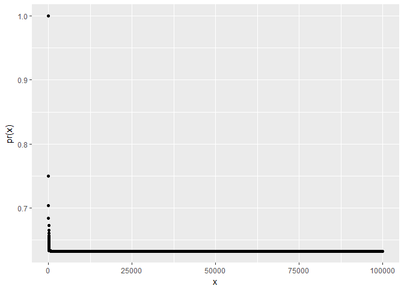

ch5\_exercises
================
Christoper Chan
January 1, 2019

``` r
library(tidyverse)
library(ISLR)
library(boot)
library(MASS)
```

Conceptual
----------

### 1

### 2

1.  /n") That is the probability of not  is the total probability minus the probability of .
2.  /n") The probabilty is the same as the 1st bootstrap observation.
3.  Bootstraping observations are independent, so the outcome of each observation does not affect the outcome of the th observation. Using the product rule we simply raise the probability of  not appearing to the th bootstraping observation
4.   = 1 - Pr(out) = 1 - (1-1/n)^n =") 0.67232
5.  0.6339677
6.  0.632139
7.  The probabilty drops off quite fast as the number of observations increase. Most are barely above zero.

``` r
pr <- function(n){
    return (1 - (1-1/n)^n)
}
x <- 1:1e5

pr_x <- tibble(x, pr(x))

ggplot(pr_x, aes(x, pr(x))) +
    geom_point()
```



1.  

``` r
store <- rep(NA, 1000)
for (i in 1:1000){
    store[i] <- sum(sample(1:100, rep=T)==4) > 0
}

mean(store)
```

    ## [1] 0.632

### 3

1.  Divides the dataset into  blocks and validates the data on the th block for that iteration. The blocks rotate until all  blocks have been used as the validation block. The test error is averaged over all iterations.
2.  -   More groups give a better representation of the true test error because of the larger sample size. It also has a lower variance. It will also have lower bias as it tends not to overfit to the training data.
    -   Computationally it is more efficient as it does not have to iterate  times. Also -fold cv will have a lower bias.

### 4

Applied
-------

### 5

1.  

``` r
set.seed(1)


summary(Default)
```

    ##  default    student       balance           income     
    ##  No :9667   No :7056   Min.   :   0.0   Min.   :  772  
    ##  Yes: 333   Yes:2944   1st Qu.: 481.7   1st Qu.:21340  
    ##                        Median : 823.6   Median :34553  
    ##                        Mean   : 835.4   Mean   :33517  
    ##                        3rd Qu.:1166.3   3rd Qu.:43808  
    ##                        Max.   :2654.3   Max.   :73554

``` r
lg <- glm(default~balance + income, Default, family='binomial')
summary(lg)
```

    ## 
    ## Call:
    ## glm(formula = default ~ balance + income, family = "binomial", 
    ##     data = Default)
    ## 
    ## Deviance Residuals: 
    ##     Min       1Q   Median       3Q      Max  
    ## -2.4725  -0.1444  -0.0574  -0.0211   3.7245  
    ## 
    ## Coefficients:
    ##               Estimate Std. Error z value Pr(>|z|)    
    ## (Intercept) -1.154e+01  4.348e-01 -26.545  < 2e-16 ***
    ## balance      5.647e-03  2.274e-04  24.836  < 2e-16 ***
    ## income       2.081e-05  4.985e-06   4.174 2.99e-05 ***
    ## ---
    ## Signif. codes:  0 '***' 0.001 '**' 0.01 '*' 0.05 '.' 0.1 ' ' 1
    ## 
    ## (Dispersion parameter for binomial family taken to be 1)
    ## 
    ##     Null deviance: 2920.6  on 9999  degrees of freedom
    ## Residual deviance: 1579.0  on 9997  degrees of freedom
    ## AIC: 1585
    ## 
    ## Number of Fisher Scoring iterations: 8

1.  

``` r
val <- function() {
    train <- sample(1:nrow(Default), nrow(Default)/2)
    test <- slice(Default, -train)

    glm_fit <- glm(default~balance + income, Default, family='binomial', subset=train)

    t <- predict(glm_fit, test, type='response')
    glm_pred <- rep('No', nrow(test))
    glm_pred[t >0.5] = 'Yes'

    return (mean(glm_pred != test$default))
}


val()
```

    ## Warning: package 'bindrcpp' was built under R version 3.4.4

    ## [1] 0.0286

1.  They all have low errors that are relatively similar.

``` r
map(seq_len(3), ~val())
```

    ## [[1]]
    ## [1] 0.0236
    ## 
    ## [[2]]
    ## [1] 0.028
    ## 
    ## [[3]]
    ## [1] 0.0268

1.  

### 9

1.  

``` r
attach(Boston)
summary(Boston)
```

    ##       crim                zn             indus            chas        
    ##  Min.   : 0.00632   Min.   :  0.00   Min.   : 0.46   Min.   :0.00000  
    ##  1st Qu.: 0.08204   1st Qu.:  0.00   1st Qu.: 5.19   1st Qu.:0.00000  
    ##  Median : 0.25651   Median :  0.00   Median : 9.69   Median :0.00000  
    ##  Mean   : 3.61352   Mean   : 11.36   Mean   :11.14   Mean   :0.06917  
    ##  3rd Qu.: 3.67708   3rd Qu.: 12.50   3rd Qu.:18.10   3rd Qu.:0.00000  
    ##  Max.   :88.97620   Max.   :100.00   Max.   :27.74   Max.   :1.00000  
    ##       nox               rm             age              dis        
    ##  Min.   :0.3850   Min.   :3.561   Min.   :  2.90   Min.   : 1.130  
    ##  1st Qu.:0.4490   1st Qu.:5.886   1st Qu.: 45.02   1st Qu.: 2.100  
    ##  Median :0.5380   Median :6.208   Median : 77.50   Median : 3.207  
    ##  Mean   :0.5547   Mean   :6.285   Mean   : 68.57   Mean   : 3.795  
    ##  3rd Qu.:0.6240   3rd Qu.:6.623   3rd Qu.: 94.08   3rd Qu.: 5.188  
    ##  Max.   :0.8710   Max.   :8.780   Max.   :100.00   Max.   :12.127  
    ##       rad              tax           ptratio          black       
    ##  Min.   : 1.000   Min.   :187.0   Min.   :12.60   Min.   :  0.32  
    ##  1st Qu.: 4.000   1st Qu.:279.0   1st Qu.:17.40   1st Qu.:375.38  
    ##  Median : 5.000   Median :330.0   Median :19.05   Median :391.44  
    ##  Mean   : 9.549   Mean   :408.2   Mean   :18.46   Mean   :356.67  
    ##  3rd Qu.:24.000   3rd Qu.:666.0   3rd Qu.:20.20   3rd Qu.:396.23  
    ##  Max.   :24.000   Max.   :711.0   Max.   :22.00   Max.   :396.90  
    ##      lstat            medv      
    ##  Min.   : 1.73   Min.   : 5.00  
    ##  1st Qu.: 6.95   1st Qu.:17.02  
    ##  Median :11.36   Median :21.20  
    ##  Mean   :12.65   Mean   :22.53  
    ##  3rd Qu.:16.95   3rd Qu.:25.00  
    ##  Max.   :37.97   Max.   :50.00

``` r
medv_mn <- mean(medv)
```

1.  

``` r
medv_err <- sd(medv)/sqrt(length(medv))
medv_err
```

    ## [1] 0.4088611
