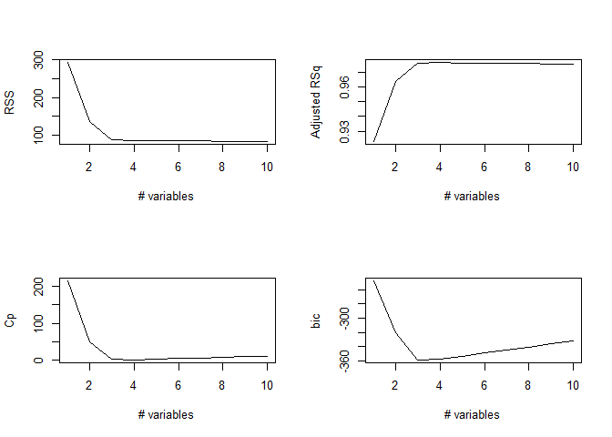
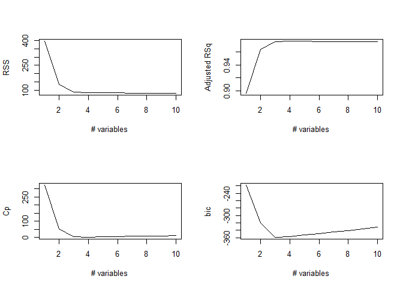
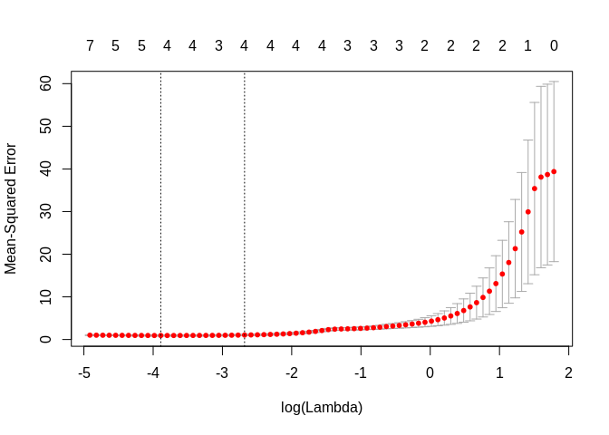

ch6\_exercises
================
Christopher Chan
December 23, 2018

``` r
library(tidyverse)
library(glmnet)
library(leaps)
```

Conceptual
----------

### 1

1.  Best subset should have the lowest RSS because it compares all possible models, while stepwise regression only compares paraments based on the past parameters.
2.  It depends, but most likely best subset should have the lowest RSS.
3.  1.  True
    2.  True
    3.  False
    4.  False
    5.  False

### 2

1.  1.  Lasso greatly decreases variance at the cost of increased biases when compared to LSR.

2.  1.  Same as lasso

3.  1.  Answer

### 3

1.  1.  Increasing s from 0 will cause *β* to increase from 0 to their least squares estimate value.

2.  1.  While lasso provides a decreased variance, it increases bias. once *β* reaches their LR values they overfit the test data.

3.  1.  Variance increases you include more data into the model.

4.  1.  Lasso insures that LR estimate values are reached.

5.  1.  By definition irreducible error is model independent.

### 4

1.  1.  Increasing *θ* will increase the RSS because when *θ* = 0 the *β* coefficients are at their OSL estimated values, so increasing *θ* will decrease the *β* coefficients, increasing the RSS.

2.  1.  With *θ* = 0 *β* coefficients are at their OSL estimated values, meaning they are overfitted to the training data. They have a bias towards the training data, so the test RSS will be high. As *θ* increases the bias decreases, so test RSS decreases. However, as some *β* reach zero the model becomes too simple and test RSS increases.

3.  1.  High variance at *θ* = 0 and decreases as parameters are removed.

4.  1.  Very low bias at *θ* = 0 and as *β*s are removed the model fits the training data less, so bias increases.

5.  1.  By definition irreducible error is model independent.

Applied
-------

### 8

1.  

``` r
set.seed(1)

x <- rnorm(100)
noise <- rnorm(100)
```

1.  

``` r
b_0 <- 17
b_1 <- 3
b_2 <- -0.5
b_3 <- -3

y = b_0 + b_1*x + b_2*x^2 + b_3*x^3 + noise
```

1.  

``` r
df <- tibble(x, y)

poly_x <- regsubsets(y~poly(x, 10, raw = T), data=df, nvmax=10)
summary_poly_x <- summary(poly_x)
```

Best subset - optimal polynomial is 4

``` r
which.min(summary_poly_x$cp)
```

    ## [1] 4

``` r
which.min(summary_poly_x$bic)
```

    ## [1] 3

``` r
which.min(summary_poly_x$adjr2)
```

    ## [1] 1

``` r
coef(poly_x, id = 3)
```

    ##           (Intercept) poly(x, 10, raw = T)1 poly(x, 10, raw = T)2 
    ##             17.061507              2.975280             -0.623791 
    ## poly(x, 10, raw = T)3 
    ##             -2.982361

``` r
par(mfrow=c(2,2))
plot(summary_poly_x$rss, xlab='# variables', ylab='RSS', type='l')
plot(summary_poly_x$adjr2, xlab='# variables', ylab='Adjusted RSq', type='l')
plot(summary_poly_x$cp, xlab='# variables', ylab='Cp', type='l')
plot(summary_poly_x$bic, xlab='# variables', ylab='bic', type='l')
```



1.  Forward - optimal polynomial is 5

``` r
poly_fwd <- regsubsets(y~poly(x, 10, raw=T), df, nvmax=10, method='forward')
summary_poly_fwd <- summary(poly_fwd)

which.min(summary_poly_fwd$cp)
```

    ## [1] 5

``` r
which.min(summary_poly_fwd$bic)
```

    ## [1] 5

``` r
which.min(summary_poly_fwd$adjr2)
```

    ## [1] 1

Backward - optimal polynomial is 3

``` r
poly_bwd <- regsubsets(y~poly(x, 10, raw=T), df, nvmax=10, method='backward')
summary_poly_bwd <- summary(poly_bwd)

which.min(summary_poly_bwd$cp)
```

    ## [1] 4

``` r
which.min(summary_poly_bwd$bic)
```

    ## [1] 3

``` r
which.min(summary_poly_bwd$adjr2)
```

    ## [1] 1

``` r
par(mfrow=c(2,2))
plot(summary_poly_bwd$rss, xlab='# variables', ylab='RSS', type='l')
plot(summary_poly_bwd$adjr2, xlab='# variables', ylab='Adjusted RSq', type='l')
plot(summary_poly_bwd$cp, xlab='# variables', ylab='Cp', type='l')
plot(summary_poly_bwd$bic, xlab='# variables', ylab='bic', type='l')
```



Best subset and backward stepwise regression are quite close while foward stepwise regression is a little farther away.

1.  

``` r
model_mat <- model.matrix(y~poly(x, 10, raw=T), df)[,-1]

lasso <- cv.glmnet(model_mat, y)


plot(lasso)
```



``` r
best_lmd <- lasso$lambda.min
best_lmd
```

    ## [1] 0.02044895

``` r
out <- glmnet(model_mat, y)
predict(out, type='coefficients', s=best_lmd)
```

    ## 11 x 1 sparse Matrix of class "dgCMatrix"
    ##                                  1
    ## (Intercept)            17.08548494
    ## poly(x, 10, raw = T)1   2.88343718
    ## poly(x, 10, raw = T)2  -0.67113590
    ## poly(x, 10, raw = T)3  -2.95973383
    ## poly(x, 10, raw = T)4   .         
    ## poly(x, 10, raw = T)5   .         
    ## poly(x, 10, raw = T)6   .         
    ## poly(x, 10, raw = T)7   .         
    ## poly(x, 10, raw = T)8   .         
    ## poly(x, 10, raw = T)9   .         
    ## poly(x, 10, raw = T)10  0.00013629

The lasso model predicts that *X*<sup>9</sup> preforms the best, far better than the other models.

1.  Generate the new response variable.

``` r
b_7 = 7

y = b_0 + b_7*(x^7) + noise
```

Best subset regression. Again it chooses something between 3 and 4, so i'll pick 4.

``` r
best_sub <- regsubsets(y~poly(x, 10, raw=T), df, nvmax=10)

s_best_sub <- summary(best_sub)
which.min(s_best_sub$cp)
```

    ## [1] 4

``` r
which.min(s_best_sub$bic)
```

    ## [1] 3

``` r
which.min(s_best_sub$adjr2)
```

    ## [1] 1

``` r
coef(best_sub, id=4)
```

    ##           (Intercept) poly(x, 10, raw = T)1 poly(x, 10, raw = T)2 
    ##           17.07200775            3.38745596           -0.65424359 
    ## poly(x, 10, raw = T)3 poly(x, 10, raw = T)5 
    ##           -3.44202574            0.08072292

Lasso only returns 1 significant model; *X*<sup>7</sup>. All other models have been reduced to 0.

``` r
lasso7 <- cv.glmnet(model_mat, y)
best_lmd <- lasso7$lambda.min
best_lmd
```

    ## [1] 13.57478

``` r
out <- glmnet(model_mat, y)
predict(out, type='coefficients', s=best_lmd)
```

    ## 11 x 1 sparse Matrix of class "dgCMatrix"
    ##                                1
    ## (Intercept)            17.904188
    ## poly(x, 10, raw = T)1   .       
    ## poly(x, 10, raw = T)2   .       
    ## poly(x, 10, raw = T)3   .       
    ## poly(x, 10, raw = T)4   .       
    ## poly(x, 10, raw = T)5   .       
    ## poly(x, 10, raw = T)6   .       
    ## poly(x, 10, raw = T)7   6.776797
    ## poly(x, 10, raw = T)8   .       
    ## poly(x, 10, raw = T)9   .       
    ## poly(x, 10, raw = T)10  .
