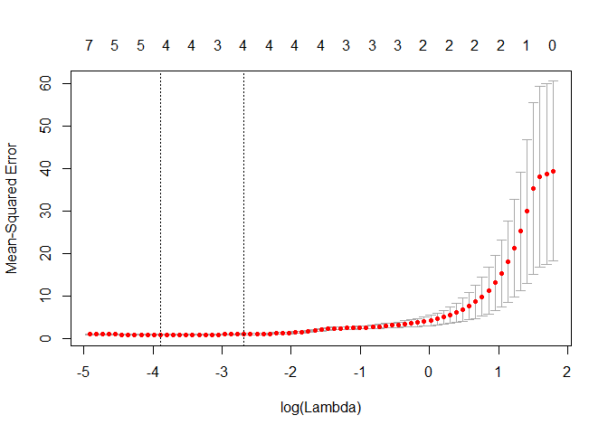
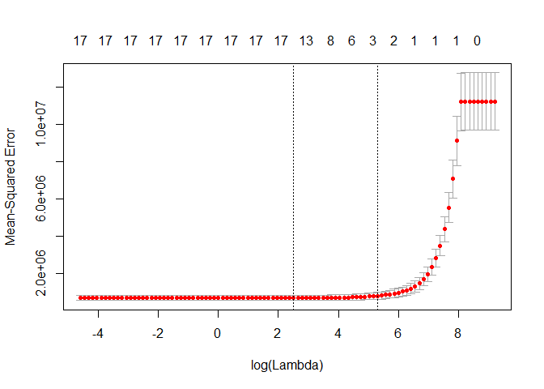
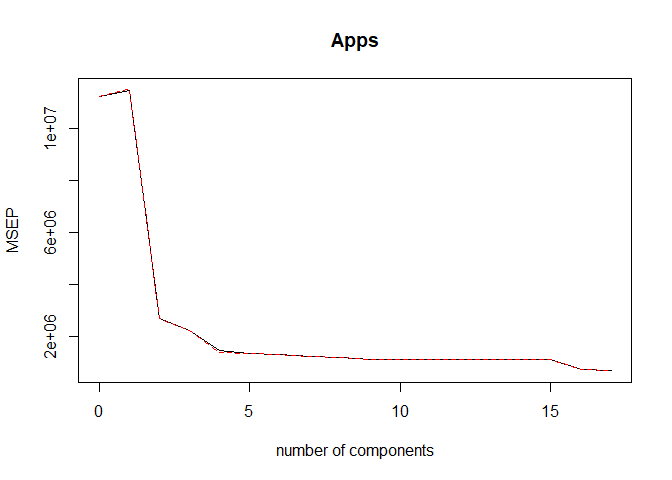
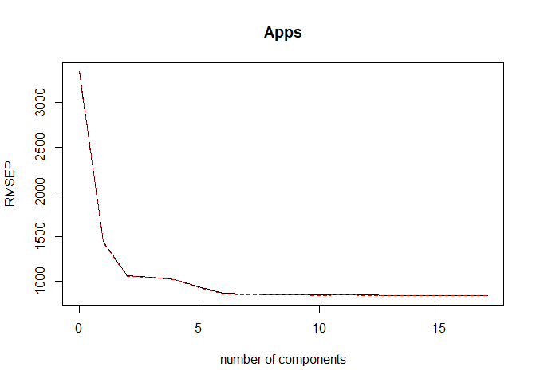
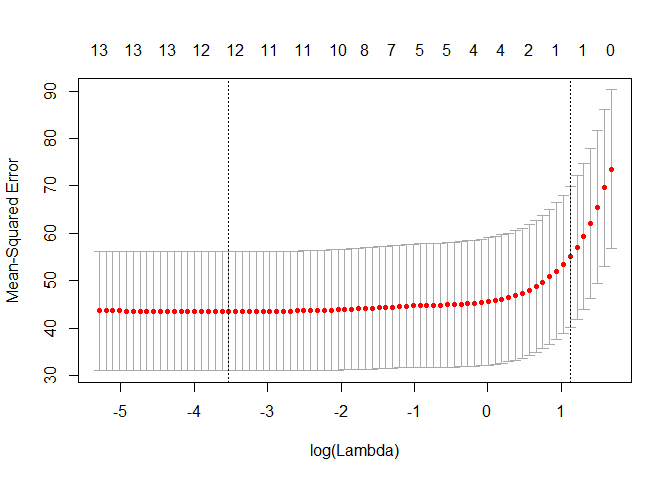
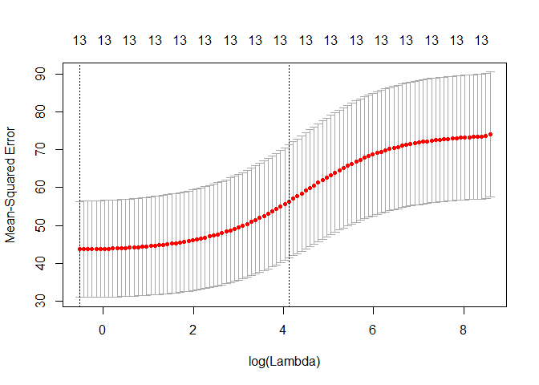
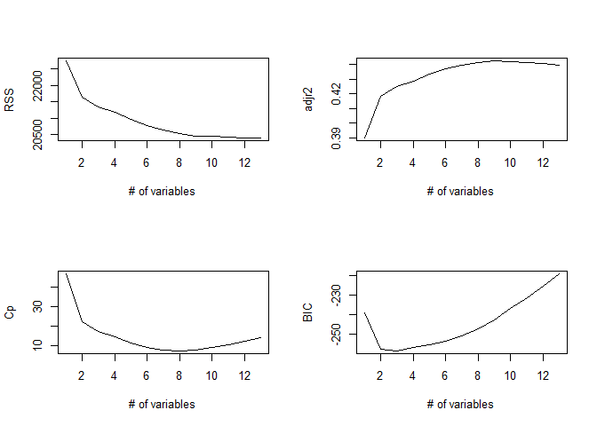

ch6\_exercises
================
Christopher Chan
December 23, 2018

``` r
library(tidyverse)
library(glmnet)
library(leaps)
library(MASS)
library(pls)
library(ISLR)
```

Conceptual
----------

### 1

1.  Best subset should have the lowest RSS because it compares all possible models, while stepwise regression only compares paraments based on the past parameters.
2.  It depends, but most likely best subset should have the lowest RSS.
3.  1.  True
    2.  True
    3.  False
    4.  False
    5.  False

### 2

1.  1.  Lasso greatly decreases variance at the cost of increased biases when compared to LSR.

2.  1.  Same as lasso

3.  1.  Answer

### 3

1.  1.  Increasing s from 0 will cause *β* to increase from 0 to their least squares estimate value.

2.  1.  While lasso provides a decreased variance, it increases bias. once *β* reaches their LR values they overfit the test data.

3.  1.  Variance increases you include more data into the model.

4.  1.  Lasso insures that LR estimate values are reached.

5.  1.  By definition irreducible error is model independent.

### 4

1.  1.  Increasing *θ* will increase the RSS because when *θ* = 0 the *β* coefficients are at their OSL estimated values, so increasing *θ* will decrease the *β* coefficients, increasing the RSS.

2.  1.  With *θ* = 0 *β* coefficients are at their OSL estimated values, meaning they are overfitted to the training data. They have a bias towards the training data, so the test RSS will be high. As *θ* increases the bias decreases, so test RSS decreases. However, as some *β* reach zero the model becomes too simple and test RSS increases.

3.  1.  High variance at *θ* = 0 and decreases as parameters are removed.

4.  1.  Very low bias at *θ* = 0 and as *β*s are removed the model fits the training data less, so bias increases.

5.  1.  By definition irreducible error is model independent.

Applied
-------

### 8

1.  

``` r
set.seed(1)

x <- rnorm(100)
noise <- rnorm(100)
```

1.  

``` r
b_0 <- 17
b_1 <- 3
b_2 <- -0.5
b_3 <- -3

y = b_0 + b_1*x + b_2*x^2 + b_3*x^3 + noise
```

1.  

``` r
df <- tibble(x, y)

poly_x <- regsubsets(y~poly(x, 10, raw = T), data=df, nvmax=10)
summary_poly_x <- summary(poly_x)
```

Best subset - optimal polynomial is 4

``` r
which.min(summary_poly_x$cp)
```

    ## [1] 4

``` r
which.min(summary_poly_x$bic)
```

    ## [1] 3

``` r
which.min(summary_poly_x$adjr2)
```

    ## [1] 1

``` r
coef(poly_x, id = 3)
```

    ##           (Intercept) poly(x, 10, raw = T)1 poly(x, 10, raw = T)2 
    ##             17.061507              2.975280             -0.623791 
    ## poly(x, 10, raw = T)3 
    ##             -2.982361

``` r
par(mfrow=c(2,2))
plot(summary_poly_x$rss, xlab='# variables', ylab='RSS', type='l')
plot(summary_poly_x$adjr2, xlab='# variables', ylab='Adjusted RSq', type='l')
plot(summary_poly_x$cp, xlab='# variables', ylab='Cp', type='l')
plot(summary_poly_x$bic, xlab='# variables', ylab='bic', type='l')
```


1.  Forward - optimal polynomial is 5

``` r
poly_fwd <- regsubsets(y~poly(x, 10, raw=T), df, nvmax=10, method='forward')
summary_poly_fwd <- summary(poly_fwd)

which.min(summary_poly_fwd$cp)
```

    ## [1] 5

``` r
which.min(summary_poly_fwd$bic)
```

    ## [1] 5

``` r
which.min(summary_poly_fwd$adjr2)
```

    ## [1] 1

Backward - optimal polynomial is 3

``` r
poly_bwd <- regsubsets(y~poly(x, 10, raw=T), df, nvmax=10, method='backward')
summary_poly_bwd <- summary(poly_bwd)

which.min(summary_poly_bwd$cp)
```

    ## [1] 4

``` r
which.min(summary_poly_bwd$bic)
```

    ## [1] 3

``` r
which.min(summary_poly_bwd$adjr2)
```

    ## [1] 1

``` r
par(mfrow=c(2,2))
plot(summary_poly_bwd$rss, xlab='# variables', ylab='RSS', type='l')
plot(summary_poly_bwd$adjr2, xlab='# variables', ylab='Adjusted RSq', type='l')
plot(summary_poly_bwd$cp, xlab='# variables', ylab='Cp', type='l')
plot(summary_poly_bwd$bic, xlab='# variables', ylab='bic', type='l')
```


Best subset and backward stepwise regression are quite close while foward stepwise regression is a little farther away.

1.  

``` r
model_mat <- model.matrix(y~poly(x, 10, raw=T), df)[,-1]

lasso <- cv.glmnet(model_mat, y)


plot(lasso)
```



``` r
best_lmd <- lasso$lambda.min
best_lmd
```

    ## [1] 0.02044895

``` r
out <- glmnet(model_mat, y)
predict(out, type='coefficients', s=best_lmd)
```

    ## 11 x 1 sparse Matrix of class "dgCMatrix"
    ##                                  1
    ## (Intercept)            17.08548494
    ## poly(x, 10, raw = T)1   2.88343718
    ## poly(x, 10, raw = T)2  -0.67113590
    ## poly(x, 10, raw = T)3  -2.95973383
    ## poly(x, 10, raw = T)4   .         
    ## poly(x, 10, raw = T)5   .         
    ## poly(x, 10, raw = T)6   .         
    ## poly(x, 10, raw = T)7   .         
    ## poly(x, 10, raw = T)8   .         
    ## poly(x, 10, raw = T)9   .         
    ## poly(x, 10, raw = T)10  0.00013629

The lasso model predicts that *X*<sup>9</sup> preforms the best, far better than the other models.

1.  Generate the new response variable.

``` r
b_7 = 7

y = b_0 + b_7*(x^7) + noise
```

Best subset regression. Again it chooses something between 3 and 4, so i'll pick 4.

``` r
best_sub <- regsubsets(y~poly(x, 10, raw=T), df, nvmax=10)

s_best_sub <- summary(best_sub)
which.min(s_best_sub$cp)
```

    ## [1] 4

``` r
which.min(s_best_sub$bic)
```

    ## [1] 3

``` r
which.min(s_best_sub$adjr2)
```

    ## [1] 1

``` r
coef(best_sub, id=4)
```

    ##           (Intercept) poly(x, 10, raw = T)1 poly(x, 10, raw = T)2 
    ##           17.07200775            3.38745596           -0.65424359 
    ## poly(x, 10, raw = T)3 poly(x, 10, raw = T)5 
    ##           -3.44202574            0.08072292

Lasso only returns 1 significant model; *X*<sup>7</sup>. All other models have been reduced to 0.

``` r
lasso7 <- cv.glmnet(model_mat, y)
best_lmd <- lasso7$lambda.min
best_lmd
```

    ## [1] 13.57478

``` r
out <- glmnet(model_mat, y)
predict(out, type='coefficients', s=best_lmd)
```

    ## 11 x 1 sparse Matrix of class "dgCMatrix"
    ##                                1
    ## (Intercept)            17.904188
    ## poly(x, 10, raw = T)1   .       
    ## poly(x, 10, raw = T)2   .       
    ## poly(x, 10, raw = T)3   .       
    ## poly(x, 10, raw = T)4   .       
    ## poly(x, 10, raw = T)5   .       
    ## poly(x, 10, raw = T)6   .       
    ## poly(x, 10, raw = T)7   6.776797
    ## poly(x, 10, raw = T)8   .       
    ## poly(x, 10, raw = T)9   .       
    ## poly(x, 10, raw = T)10  .

### 9

1.  

``` r
set.seed(5)

train <- sample(1:nrow(College), nrow(College)/2)
test <- (-train)

c_train <- College[train,]
c_test <- College[test,]
```

1.  

``` r
c_lm <- lm(Apps~., c_train)

summary(c_lm)
```

    ## 
    ## Call:
    ## lm(formula = Apps ~ ., data = c_train)
    ## 
    ## Residuals:
    ##     Min      1Q  Median      3Q     Max 
    ## -4059.0  -321.1   -52.1   202.1  4520.2 
    ## 
    ## Coefficients:
    ##               Estimate Std. Error t value Pr(>|t|)    
    ## (Intercept) -516.46890  427.30465  -1.209 0.227563    
    ## PrivateYes  -489.20696  146.04941  -3.350 0.000893 ***
    ## Accept         1.51065    0.05627  26.846  < 2e-16 ***
    ## Enroll        -0.91505    0.21303  -4.295 2.23e-05 ***
    ## Top10perc     18.56038    5.98821   3.099 0.002087 ** 
    ## Top25perc      1.71216    4.53255   0.378 0.705834    
    ## F.Undergrad    0.07678    0.03402   2.257 0.024621 *  
    ## P.Undergrad    0.08408    0.02993   2.810 0.005223 ** 
    ## Outstate      -0.06182    0.02065  -2.994 0.002941 ** 
    ## Room.Board     0.14898    0.05273   2.825 0.004978 ** 
    ## Books          0.07260    0.24940   0.291 0.771143    
    ## Personal      -0.04735    0.06964  -0.680 0.497036    
    ## PhD           -5.90643    4.81851  -1.226 0.221061    
    ## Terminal      -1.51049    5.05802  -0.299 0.765388    
    ## S.F.Ratio     10.64647   13.05184   0.816 0.415193    
    ## perc.alumni   -1.38931    4.12292  -0.337 0.736330    
    ## Expend         0.06249    0.01428   4.375 1.58e-05 ***
    ## Grad.Rate      5.61176    3.07949   1.822 0.069216 .  
    ## ---
    ## Signif. codes:  0 '***' 0.001 '**' 0.01 '*' 0.05 '.' 0.1 ' ' 1
    ## 
    ## Residual standard error: 757.2 on 370 degrees of freedom
    ## Multiple R-squared:  0.951,  Adjusted R-squared:  0.9487 
    ## F-statistic: 422.2 on 17 and 370 DF,  p-value: < 2.2e-16

RSS

``` r
lm_pred <- predict(c_lm, c_test)

mean((c_test[, 'Apps'] - lm_pred)^2)
```

    ## [1] 1835615

1.  Creating model.matrix for training and testing data. This makes it so that we can work with the datasets.

``` r
train_mat <- model.matrix(Apps~., c_train)
test_mat <- model.matrix(Apps~., c_test)
grid <- 10^seq(4,-2, length=100)

c_rr <- cv.glmnet(train_mat, c_train[, 'Apps'], alpha=0, lambda=grid, thresh=1e-12)
best_lambda <- c_rr$lambda.min
best_lambda
```

    ## [1] 24.77076

Ridge regression has a slightly higher RSS than OSL.

``` r
pred <- predict(c_rr, newx=test_mat, s=best_lambda)
mean((pred - c_test[,'Apps'])^2)
```

    ## [1] 1870783

1.  

``` r
c_lasso <- cv.glmnet(train_mat, c_train[, 'Apps'], lambda=grid, thresh=1e-12)
plot(c_lasso)
```



``` r
lasso_lam <- c_lasso$lambda.min
lasso_lam
```

    ## [1] 12.32847

We have a much higher RSS than OLS.

``` r
pred_lasso <- predict(c_lasso, newx=test_mat, s=lasso_lam)
mean((pred_lasso - c_test[, 'Apps'])^2)
```

    ## [1] 1874525

1.  Based on the MSEP plot the lowest MSEP occurs at 17 predictors. But really, the gain is minimal so I think we can safely use 4 predictors.

``` r
pcr_fit <- pcr(Apps~., data=c_train, scale=T, validation='CV')

validationplot(pcr_fit, val.type = 'MSEP')
```



With the number of components at 4 we get a RSS of 3660863. The RSS is relatively steady until running predict with ncomp=16 where the RSS drops to roughly half.

``` r
pcr_pred <- predict(pcr_fit, c_test, ncomp=4)
mean((pcr_pred - c_test[,'Apps'])^2)
```

    ## [1] 3660863

1.  

``` r
pls_fit <- plsr(Apps~., data=c_train, scale=T, validation='CV')
summary(pls_fit)
```

    ## Data:    X dimension: 388 17 
    ##  Y dimension: 388 1
    ## Fit method: kernelpls
    ## Number of components considered: 17
    ## 
    ## VALIDATION: RMSEP
    ## Cross-validated using 10 random segments.
    ##        (Intercept)  1 comps  2 comps  3 comps  4 comps  5 comps  6 comps
    ## CV            3348     1444     1059     1040     1017    932.5    864.8
    ## adjCV         3348     1439     1049     1043     1014    924.1    858.4
    ##        7 comps  8 comps  9 comps  10 comps  11 comps  12 comps  13 comps
    ## CV       854.0    849.5    849.6     846.2     849.4     844.2     841.5
    ## adjCV    848.3    843.9    843.6     840.3     842.6     838.1     835.7
    ##        14 comps  15 comps  16 comps  17 comps
    ## CV        840.8     840.7     840.9     840.9
    ## adjCV     835.1     835.0     835.1     835.2
    ## 
    ## TRAINING: % variance explained
    ##       1 comps  2 comps  3 comps  4 comps  5 comps  6 comps  7 comps
    ## X       24.48    31.85    62.50    66.71    69.79    73.37    76.82
    ## Apps    82.87    90.86    91.25    92.46    94.04    94.80    94.90
    ##       8 comps  9 comps  10 comps  11 comps  12 comps  13 comps  14 comps
    ## X       80.01    82.60     84.78     86.06     89.22     93.08     94.69
    ## Apps    94.96    95.02     95.06     95.09     95.10     95.10     95.10
    ##       15 comps  16 comps  17 comps
    ## X        97.05     99.03     100.0
    ## Apps     95.10     95.10      95.1

``` r
validationplot(pls_fit)
```



The RSS for the PLS is 1856693.

``` r
pls_predict <- predict(pls_fit, c_test, ncomp=6)
mean((pls_predict - c_test[,'Apps'])^2)
```

    ## [1] 1856693

1.  PCR has by far the worst test error.

### 10

### 11

1.  Getting a sense of the data.

``` r
head(Boston)
```

    ##      crim zn indus chas   nox    rm  age    dis rad tax ptratio  black
    ## 1 0.00632 18  2.31    0 0.538 6.575 65.2 4.0900   1 296    15.3 396.90
    ## 2 0.02731  0  7.07    0 0.469 6.421 78.9 4.9671   2 242    17.8 396.90
    ## 3 0.02729  0  7.07    0 0.469 7.185 61.1 4.9671   2 242    17.8 392.83
    ## 4 0.03237  0  2.18    0 0.458 6.998 45.8 6.0622   3 222    18.7 394.63
    ## 5 0.06905  0  2.18    0 0.458 7.147 54.2 6.0622   3 222    18.7 396.90
    ## 6 0.02985  0  2.18    0 0.458 6.430 58.7 6.0622   3 222    18.7 394.12
    ##   lstat medv
    ## 1  4.98 24.0
    ## 2  9.14 21.6
    ## 3  4.03 34.7
    ## 4  2.94 33.4
    ## 5  5.33 36.2
    ## 6  5.21 28.7

``` r
summary(Boston)
```

    ##       crim                zn             indus            chas        
    ##  Min.   : 0.00632   Min.   :  0.00   Min.   : 0.46   Min.   :0.00000  
    ##  1st Qu.: 0.08204   1st Qu.:  0.00   1st Qu.: 5.19   1st Qu.:0.00000  
    ##  Median : 0.25651   Median :  0.00   Median : 9.69   Median :0.00000  
    ##  Mean   : 3.61352   Mean   : 11.36   Mean   :11.14   Mean   :0.06917  
    ##  3rd Qu.: 3.67708   3rd Qu.: 12.50   3rd Qu.:18.10   3rd Qu.:0.00000  
    ##  Max.   :88.97620   Max.   :100.00   Max.   :27.74   Max.   :1.00000  
    ##       nox               rm             age              dis        
    ##  Min.   :0.3850   Min.   :3.561   Min.   :  2.90   Min.   : 1.130  
    ##  1st Qu.:0.4490   1st Qu.:5.886   1st Qu.: 45.02   1st Qu.: 2.100  
    ##  Median :0.5380   Median :6.208   Median : 77.50   Median : 3.207  
    ##  Mean   :0.5547   Mean   :6.285   Mean   : 68.57   Mean   : 3.795  
    ##  3rd Qu.:0.6240   3rd Qu.:6.623   3rd Qu.: 94.08   3rd Qu.: 5.188  
    ##  Max.   :0.8710   Max.   :8.780   Max.   :100.00   Max.   :12.127  
    ##       rad              tax           ptratio          black       
    ##  Min.   : 1.000   Min.   :187.0   Min.   :12.60   Min.   :  0.32  
    ##  1st Qu.: 4.000   1st Qu.:279.0   1st Qu.:17.40   1st Qu.:375.38  
    ##  Median : 5.000   Median :330.0   Median :19.05   Median :391.44  
    ##  Mean   : 9.549   Mean   :408.2   Mean   :18.46   Mean   :356.67  
    ##  3rd Qu.:24.000   3rd Qu.:666.0   3rd Qu.:20.20   3rd Qu.:396.23  
    ##  Max.   :24.000   Max.   :711.0   Max.   :22.00   Max.   :396.90  
    ##      lstat            medv      
    ##  Min.   : 1.73   Min.   : 5.00  
    ##  1st Qu.: 6.95   1st Qu.:17.02  
    ##  Median :11.36   Median :21.20  
    ##  Mean   :12.65   Mean   :22.53  
    ##  3rd Qu.:16.95   3rd Qu.:25.00  
    ##  Max.   :37.97   Max.   :50.00

#### Lasso

Prepping the data

``` r
x <- model.matrix(crim~., Boston)[,-1]
y <- Boston$crim
```

``` r
set.seed(1)

lasso <- cv.glmnet(x, y, type.measure='mse')
plot(lasso)
```



``` r
best_lmd <- lasso$lambda.min
coef(lasso, best_lmd)
```

    ## 14 x 1 sparse Matrix of class "dgCMatrix"
    ##                        1
    ## (Intercept) 14.428038920
    ## zn           0.039364727
    ## indus       -0.071259165
    ## chas        -0.641610611
    ## nox         -8.404034502
    ## rm           0.321491734
    ## age          .          
    ## dis         -0.875434880
    ## rad          0.538512550
    ## tax         -0.001104582
    ## ptratio     -0.223867380
    ## black       -0.007540242
    ## lstat        0.127002383
    ## medv        -0.174760563

``` r
#finding MSE
i <- which(lasso$lambda == lasso$lambda.min)
mse_min <- lasso$cvm[i]
cat('MSE at min lambda: ', mse_min)
```

    ## MSE at min lambda:  43.57399

### Ridge

I believe I can do a very similar thing as I did for lasso.

``` r
set.seed(1)

ridge <- cv.glmnet(x, y, type.measure='mse', alpha=0)
plot(ridge)
```



``` r
ridge_lmd <- ridge$lambda.min
coef(ridge, ridge_lmd)
```

    ## 14 x 1 sparse Matrix of class "dgCMatrix"
    ##                        1
    ## (Intercept)  8.617905238
    ## zn           0.032352168
    ## indus       -0.081183885
    ## chas        -0.739986141
    ## nox         -5.095661077
    ## rm           0.328170831
    ## age          0.002074971
    ## dis         -0.683786236
    ## rad          0.414237410
    ## tax          0.003695600
    ## ptratio     -0.127614746
    ## black       -0.008532788
    ## lstat        0.142710654
    ## medv        -0.136308133

``` r
#Find MSE
i <- which(ridge$lambda == ridge$lambda.min)
mse_min <- ridge$cvm[i]
cat('MSE at min lambda: ', mse_min)
```

    ## MSE at min lambda:  43.65122

### Subset

So i'm having trouble selecting the which model to choose, *R**S**S*, $\\overline{R}^2$, *C*<sub>*p*</sub>, *B**I**C* all choose different models. I'll have to figure out how to code up a AUC or ROC function to select the best. Alternatively I can just run all the models and choose the one with the lowest MSE. I think either way i'll have to do the latter, but with running the suggested models I can run just a subset so it'll be less computationally expensive.

``` r
regfit_full <- regsubsets(crim~., Boston, nvmax=13)

regfit_full_sum <- summary(regfit_full)

par(mfrow=c(2,2))
plot(regfit_full_sum$rss, xlab='# of variables', ylab='RSS', type='l')
plot(regfit_full_sum$adjr2, xlab='# of variables', ylab='adjr2', type='l')
plot(regfit_full_sum$cp, xlab='# of variables', ylab='Cp', type='l')
plot(regfit_full_sum$bic, xlab='# of variables', ylab='BIC', type='l')
```



``` r
which.min(regfit_full_sum$rss)
```

    ## [1] 13

``` r
which.max(regfit_full_sum$adjr2)
```

    ## [1] 9

``` r
which.min(regfit_full_sum$cp)
```

    ## [1] 8

``` r
which.min(regfit_full_sum$bic)
```

    ## [1] 3
