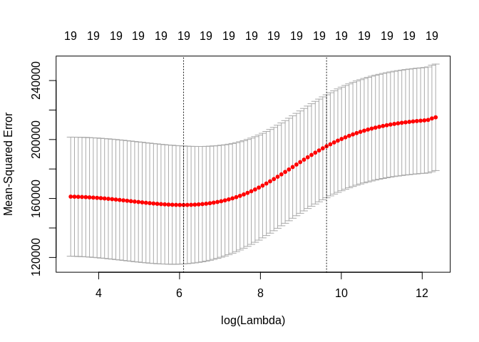

ch6\_lab2
================
Christoper Chan
December 22, 2018

``` r
library(tidyverse)
library(forecast)
library(ISLR)
library(leaps)
library(glmnet)
```

Lab 2: Ridge and Lasso Regression
=================================

6.6.1
-----

Creating a model.matrix of our Hitters data. Because rows with NA are dropped in the model.matrix function the y variable must also drop rows with NA.

``` r
x <- model.matrix(Salary~., Hitters)[,-1]
y <- Hitters$Salary %>%
    na.omit()
```

Creating an array of length 100 equally spaced distances between 10^-2 and 10^10. This will be our  values that we'll use for the section. We then run ridge regression on our grid.

``` r
grid <- 10^seq(10,-2, length=100)
ridge_mod <- glmnet(x, y, alpha=0, lambda=grid)
```

This is messing around with different lambda values, showing that high  values yield low coef and low  values give high coef.

``` r
ridge_mod$lambda[70]
```

    ## [1] 43.28761

``` r
coef(ridge_mod)[,70]
```

    ##   (Intercept)         AtBat          Hits         HmRun          Runs 
    ##   54.97384215   -0.41480601    2.10530493   -1.34828331    1.13281252 
    ##           RBI         Walks         Years        CAtBat         CHits 
    ##    0.79219405    2.83508432   -6.85814163    0.00438123    0.11187771 
    ##        CHmRun         CRuns          CRBI        CWalks       LeagueN 
    ##    0.64020753    0.23468562    0.22724180   -0.17405551   47.59278798 
    ##     DivisionW       PutOuts       Assists        Errors    NewLeagueN 
    ## -119.52546741    0.25369445    0.13095051   -3.38369142  -11.36670636

Running our ridge regression model on a set , in this case 50.

``` r
predict(ridge_mod, s=50, type='coefficients')[1:20,]
```

    ##   (Intercept)         AtBat          Hits         HmRun          Runs 
    ##  4.876610e+01 -3.580999e-01  1.969359e+00 -1.278248e+00  1.145892e+00 
    ##           RBI         Walks         Years        CAtBat         CHits 
    ##  8.038292e-01  2.716186e+00 -6.218319e+00  5.447837e-03  1.064895e-01 
    ##        CHmRun         CRuns          CRBI        CWalks       LeagueN 
    ##  6.244860e-01  2.214985e-01  2.186914e-01 -1.500245e-01  4.592589e+01 
    ##     DivisionW       PutOuts       Assists        Errors    NewLeagueN 
    ## -1.182011e+02  2.502322e-01  1.215665e-01 -3.278600e+00 -9.496680e+00

Validating our data via cross validation.

``` r
set.seed(1)

train <- sample(1:nrow(x), nrow(x)/2)
test <- (-train)
y_test <- y[test]
```

Running cross validation and calculating the MSE

``` r
ridge_mod <- glmnet(x[train,], y[train], alpha=0, lambda=grid, thresh=1e-12)
ridge_pred <- predict(ridge_mod, s=4, newx=x[test,])
mean((ridge_pred - y_test)^2)
```

    ## [1] 101036.8

Testing if  yields a better result than , ie if ridge regression has any effect.

``` r
ridge_pred_null <- predict(ridge_mod, s=0, newx=x[test,])
mean((ridge_pred_null - y_test)^2)
```

    ## [1] 114723.6

``` r
lm(y~x, subset=train)
```

    ## 
    ## Call:
    ## lm(formula = y ~ x, subset = train)
    ## 
    ## Coefficients:
    ## (Intercept)       xAtBat        xHits       xHmRun        xRuns  
    ##   299.42849     -2.54027      8.36682     11.64512     -9.09923  
    ##        xRBI       xWalks       xYears      xCAtBat       xCHits  
    ##     2.44105      9.23440    -22.93673     -0.18154     -0.11598  
    ##     xCHmRun       xCRuns        xCRBI      xCWalks     xLeagueN  
    ##    -1.33888      3.32838      0.07536     -1.07841     59.76065  
    ##  xDivisionW     xPutOuts     xAssists      xErrors  xNewLeagueN  
    ##   -98.86233      0.34087      0.34165     -0.64207     -0.67442

``` r
predict(ridge_mod, s=0, type='coefficients')[1:20,]
```

    ##  (Intercept)        AtBat         Hits        HmRun         Runs 
    ## 299.44467220  -2.53538355   8.33585019  11.59830815  -9.05971371 
    ##          RBI        Walks        Years       CAtBat        CHits 
    ##   2.45326546   9.21776006 -22.98239583  -0.18191651  -0.10565688 
    ##       CHmRun        CRuns         CRBI       CWalks      LeagueN 
    ##  -1.31721358   3.31152519   0.06590689  -1.07244477  59.75587273 
    ##    DivisionW      PutOuts      Assists       Errors   NewLeagueN 
    ## -98.94393005   0.34083276   0.34155445  -0.65312471  -0.65882930

Based on the MSE we see that with a  of 4 ridge regression yields a better lm than without ridge regression.

``` r
set.seed(2)

cv_out <- cv.glmnet(x[train,], y[train], alpha=0)
plot(cv_out)
```



``` r
best_lam <- cv_out$lambda.min
best_lam
```

    ## [1] 445.6957

Running our model with the best  yields a slightly lower MSE than with the  above.

``` r
ridge_pred <- predict(ridge_mod, s=best_lam, newx=x[test,])
mean((ridge_pred-y_test)^2)
```

    ## [1] 97075.07

Running cross-validation and our best  to get the coef.

``` r
out <- glmnet(x, y, alpha=0)
predict(out, type='coefficients', s=best_lam)
```

    ## 20 x 1 sparse Matrix of class "dgCMatrix"
    ##                        1
    ## (Intercept)  26.37080995
    ## AtBat         0.09743107
    ## Hits          0.76975758
    ## HmRun         0.88165386
    ## Runs          1.01890492
    ## RBI           0.87479537
    ## Walks         1.50092266
    ## Years         1.99359622
    ## CAtBat        0.01126696
    ## CHits         0.05286325
    ## CHmRun        0.37769356
    ## CRuns         0.10563005
    ## CRBI          0.11111975
    ## CWalks        0.06389421
    ## LeagueN      18.57758044
    ## DivisionW   -69.20187053
    ## PutOuts       0.14685028
    ## Assists       0.02267208
    ## Errors       -1.06681329
    ## NewLeagueN    9.45522982

6.2.2 Lasso
-----------

``` r
lasso_mod <- glmnet(x[train,], y[train], lambda=grid)
plot(lasso_mod)
```


Calculating the MSE for the lasso model. The default of glmnet is alpha=1 == lasso, so the alpha term does not need to be explicitly included.

``` r
set.seed(1)

cv_out_lasso <- cv.glmnet(x[train,], y[train])
plot(cv_out_lasso)
```


``` r
best_lam <- cv_out_lasso$lambda.min
lasso_pred <- predict(lasso_mod, s=best_lam, newx=x[test,])
mean((lasso_pred-y_test)^2)
```

    ## [1] 100743.4

``` r
out <- glmnet(x, y, lambda=grid)
lasso_coef <- predict(out, type='coefficient', s=best_lam)
lasso_coef
```

    ## 20 x 1 sparse Matrix of class "dgCMatrix"
    ##                        1
    ## (Intercept)   18.5394844
    ## AtBat          .        
    ## Hits           1.8735390
    ## HmRun          .        
    ## Runs           .        
    ## RBI            .        
    ## Walks          2.2178444
    ## Years          .        
    ## CAtBat         .        
    ## CHits          .        
    ## CHmRun         .        
    ## CRuns          0.2071252
    ## CRBI           0.4130132
    ## CWalks         .        
    ## LeagueN        3.2666677
    ## DivisionW   -103.4845458
    ## PutOuts        0.2204284
    ## Assists        .        
    ## Errors         .        
    ## NewLeagueN     .
