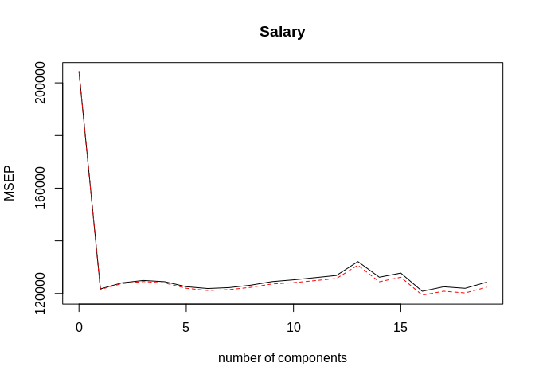
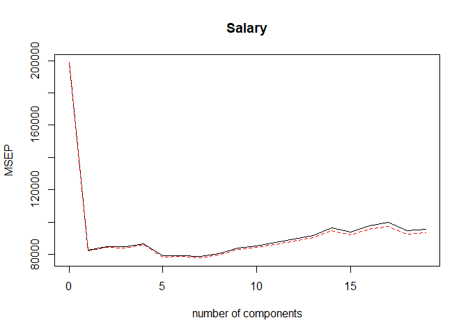

ch6\_lab3
================
Christoper Chan
December 22, 2018

``` r
library(tidyverse)
library(ISLR)
library(leaps)
library(pls)
```

Creating a PCR model based on the Hitters data with salary as the response variable. Cross validation, of 10-fold, is also conducted.

``` r
set.seed(2)

pcr_fit <- pcr(Salary~., data=Hitters, scale=T, validation='CV')
summary(pcr_fit)
```

    ## Data:    X dimension: 263 19 
    ##  Y dimension: 263 1
    ## Fit method: svdpc
    ## Number of components considered: 19
    ## 
    ## VALIDATION: RMSEP
    ## Cross-validated using 10 random segments.
    ##        (Intercept)  1 comps  2 comps  3 comps  4 comps  5 comps  6 comps
    ## CV             452    348.9    352.2    353.5    352.8    350.1    349.1
    ## adjCV          452    348.7    351.8    352.9    352.1    349.3    348.0
    ##        7 comps  8 comps  9 comps  10 comps  11 comps  12 comps  13 comps
    ## CV       349.6    350.9    352.9     353.8     355.0     356.2     363.5
    ## adjCV    348.5    349.8    351.6     352.3     353.4     354.5     361.6
    ##        14 comps  15 comps  16 comps  17 comps  18 comps  19 comps
    ## CV        355.2     357.4     347.6     350.1     349.2     352.6
    ## adjCV     352.8     355.2     345.5     347.6     346.7     349.8
    ## 
    ## TRAINING: % variance explained
    ##         1 comps  2 comps  3 comps  4 comps  5 comps  6 comps  7 comps
    ## X         38.31    60.16    70.84    79.03    84.29    88.63    92.26
    ## Salary    40.63    41.58    42.17    43.22    44.90    46.48    46.69
    ##         8 comps  9 comps  10 comps  11 comps  12 comps  13 comps  14 comps
    ## X         94.96    96.28     97.26     97.98     98.65     99.15     99.47
    ## Salary    46.75    46.86     47.76     47.82     47.85     48.10     50.40
    ##         15 comps  16 comps  17 comps  18 comps  19 comps
    ## X          99.75     99.89     99.97     99.99    100.00
    ## Salary     50.55     53.01     53.85     54.61     54.61

``` r
validationplot(pcr_fit, val.type='MSEP')
```



Recreating the x, y, training and testing datasubsets

``` r
x <- model.matrix(Salary~., Hitters)[,-1]
y <- Hitters$Salary %>%
    na.omit()

train <- sample(1:nrow(x), nrow(x)/2)
test <- (-train)
y_test <- y[test]
```

Running PCR with our training subset and graphing results.

``` r
set.seed(1)
pcr_fit <- pcr(Salary~., data=Hitters, subset=train, scale=T, validation='CV')

validationplot(pcr_fit, val.type='MSEP')
```



Based on the MSEP graph the MSE is lowest when the number of components is 7.

``` r
pcr_pred <- predict(pcr_fit, x[test,], ncomp=7)
mean((pcr_pred - y_test)^2)
```

    ## [1] 153651.8

``` r
pcr_fit <- pcr(y~x, scale=T, ncomp=7)
summary(pcr_fit)
```

    ## Data:    X dimension: 263 19 
    ##  Y dimension: 263 1
    ## Fit method: svdpc
    ## Number of components considered: 7
    ## TRAINING: % variance explained
    ##    1 comps  2 comps  3 comps  4 comps  5 comps  6 comps  7 comps
    ## X    38.31    60.16    70.84    79.03    84.29    88.63    92.26
    ## y    40.63    41.58    42.17    43.22    44.90    46.48    46.69

6.7.2
-----
