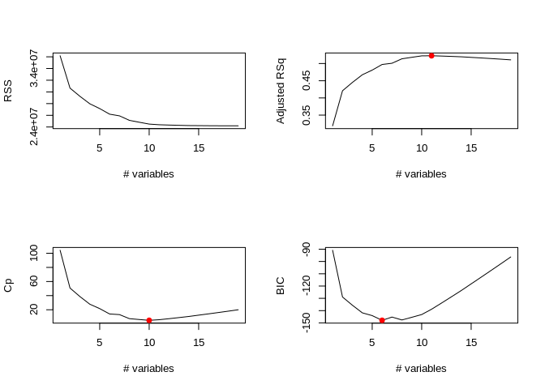
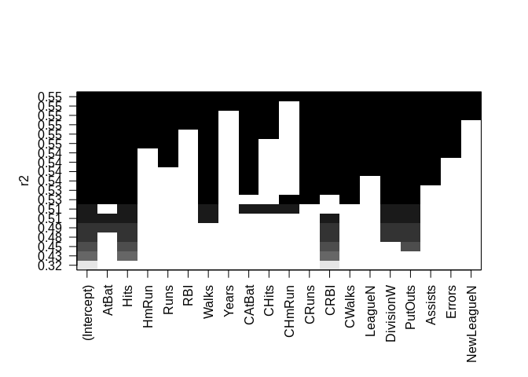
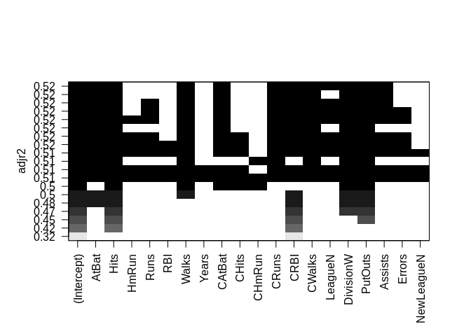
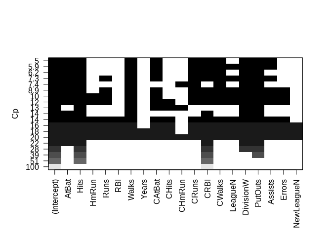
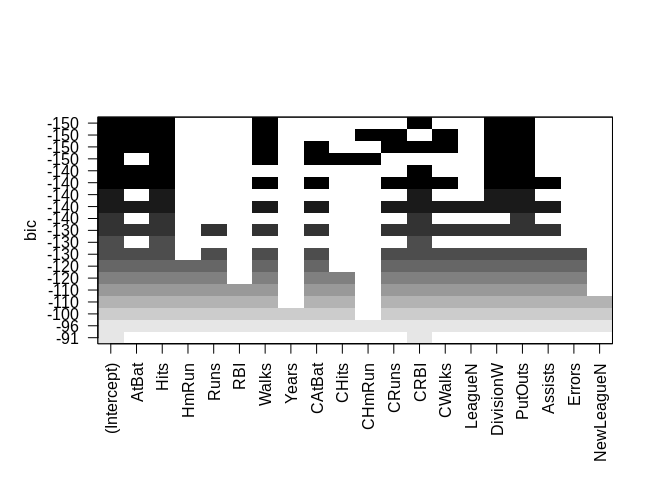

ch6\_lab
================
Christopher Chan
December 12, 2018

``` r
library(tidyverse)
library(forecast)
library(ISLR)
library(leaps)
```

\*Note: I'm going to try my best to use the tidyverse package for everything, just to get use to the environment.

Lab 1: Subset Selection Methods
===============================

6.5.1
-----

Getting a sense of the data, Hitters

``` r
dim(Hitters)
```

    ## [1] 322  20

``` r
colnames(Hitters)
```

    ##  [1] "AtBat"     "Hits"      "HmRun"     "Runs"      "RBI"      
    ##  [6] "Walks"     "Years"     "CAtBat"    "CHits"     "CHmRun"   
    ## [11] "CRuns"     "CRBI"      "CWalks"    "League"    "Division" 
    ## [16] "PutOuts"   "Assists"   "Errors"    "Salary"    "NewLeague"

``` r
glimpse(Hitters)
```

    ## Observations: 322
    ## Variables: 20
    ## $ AtBat     <int> 293, 315, 479, 496, 321, 594, 185, 298, 323, 401, 57...
    ## $ Hits      <int> 66, 81, 130, 141, 87, 169, 37, 73, 81, 92, 159, 53, ...
    ## $ HmRun     <int> 1, 7, 18, 20, 10, 4, 1, 0, 6, 17, 21, 4, 13, 0, 7, 3...
    ## $ Runs      <int> 30, 24, 66, 65, 39, 74, 23, 24, 26, 49, 107, 31, 48,...
    ## $ RBI       <int> 29, 38, 72, 78, 42, 51, 8, 24, 32, 66, 75, 26, 61, 1...
    ## $ Walks     <int> 14, 39, 76, 37, 30, 35, 21, 7, 8, 65, 59, 27, 47, 22...
    ## $ Years     <int> 1, 14, 3, 11, 2, 11, 2, 3, 2, 13, 10, 9, 4, 6, 13, 3...
    ## $ CAtBat    <int> 293, 3449, 1624, 5628, 396, 4408, 214, 509, 341, 520...
    ## $ CHits     <int> 66, 835, 457, 1575, 101, 1133, 42, 108, 86, 1332, 13...
    ## $ CHmRun    <int> 1, 69, 63, 225, 12, 19, 1, 0, 6, 253, 90, 15, 41, 4,...
    ## $ CRuns     <int> 30, 321, 224, 828, 48, 501, 30, 41, 32, 784, 702, 19...
    ## $ CRBI      <int> 29, 414, 266, 838, 46, 336, 9, 37, 34, 890, 504, 186...
    ## $ CWalks    <int> 14, 375, 263, 354, 33, 194, 24, 12, 8, 866, 488, 161...
    ## $ League    <fct> A, N, A, N, N, A, N, A, N, A, A, N, N, A, N, A, N, A...
    ## $ Division  <fct> E, W, W, E, E, W, E, W, W, E, E, W, E, E, E, W, W, W...
    ## $ PutOuts   <int> 446, 632, 880, 200, 805, 282, 76, 121, 143, 0, 238, ...
    ## $ Assists   <int> 33, 43, 82, 11, 40, 421, 127, 283, 290, 0, 445, 45, ...
    ## $ Errors    <int> 20, 10, 14, 3, 4, 25, 7, 9, 19, 0, 22, 11, 7, 6, 8, ...
    ## $ Salary    <dbl> NA, 475.000, 480.000, 500.000, 91.500, 750.000, 70.0...
    ## $ NewLeague <fct> A, N, A, N, N, A, A, A, N, A, A, N, N, A, N, A, N, A...

``` r
summary(Hitters)
```

    ##      AtBat            Hits         HmRun            Runs       
    ##  Min.   : 16.0   Min.   :  1   Min.   : 0.00   Min.   :  0.00  
    ##  1st Qu.:255.2   1st Qu.: 64   1st Qu.: 4.00   1st Qu.: 30.25  
    ##  Median :379.5   Median : 96   Median : 8.00   Median : 48.00  
    ##  Mean   :380.9   Mean   :101   Mean   :10.77   Mean   : 50.91  
    ##  3rd Qu.:512.0   3rd Qu.:137   3rd Qu.:16.00   3rd Qu.: 69.00  
    ##  Max.   :687.0   Max.   :238   Max.   :40.00   Max.   :130.00  
    ##                                                                
    ##       RBI             Walks            Years            CAtBat       
    ##  Min.   :  0.00   Min.   :  0.00   Min.   : 1.000   Min.   :   19.0  
    ##  1st Qu.: 28.00   1st Qu.: 22.00   1st Qu.: 4.000   1st Qu.:  816.8  
    ##  Median : 44.00   Median : 35.00   Median : 6.000   Median : 1928.0  
    ##  Mean   : 48.03   Mean   : 38.74   Mean   : 7.444   Mean   : 2648.7  
    ##  3rd Qu.: 64.75   3rd Qu.: 53.00   3rd Qu.:11.000   3rd Qu.: 3924.2  
    ##  Max.   :121.00   Max.   :105.00   Max.   :24.000   Max.   :14053.0  
    ##                                                                      
    ##      CHits            CHmRun           CRuns             CRBI        
    ##  Min.   :   4.0   Min.   :  0.00   Min.   :   1.0   Min.   :   0.00  
    ##  1st Qu.: 209.0   1st Qu.: 14.00   1st Qu.: 100.2   1st Qu.:  88.75  
    ##  Median : 508.0   Median : 37.50   Median : 247.0   Median : 220.50  
    ##  Mean   : 717.6   Mean   : 69.49   Mean   : 358.8   Mean   : 330.12  
    ##  3rd Qu.:1059.2   3rd Qu.: 90.00   3rd Qu.: 526.2   3rd Qu.: 426.25  
    ##  Max.   :4256.0   Max.   :548.00   Max.   :2165.0   Max.   :1659.00  
    ##                                                                      
    ##      CWalks        League  Division    PutOuts          Assists     
    ##  Min.   :   0.00   A:175   E:157    Min.   :   0.0   Min.   :  0.0  
    ##  1st Qu.:  67.25   N:147   W:165    1st Qu.: 109.2   1st Qu.:  7.0  
    ##  Median : 170.50                    Median : 212.0   Median : 39.5  
    ##  Mean   : 260.24                    Mean   : 288.9   Mean   :106.9  
    ##  3rd Qu.: 339.25                    3rd Qu.: 325.0   3rd Qu.:166.0  
    ##  Max.   :1566.00                    Max.   :1378.0   Max.   :492.0  
    ##                                                                     
    ##      Errors          Salary       NewLeague
    ##  Min.   : 0.00   Min.   :  67.5   A:176    
    ##  1st Qu.: 3.00   1st Qu.: 190.0   N:146    
    ##  Median : 6.00   Median : 425.0            
    ##  Mean   : 8.04   Mean   : 535.9            
    ##  3rd Qu.:11.00   3rd Qu.: 750.0            
    ##  Max.   :32.00   Max.   :2460.0            
    ##                  NA's   :59

Dropping rows that are missing the salary value. Base R uses na.omit.

``` r
sum(is.na(Hitters$Salary))
```

    ## [1] 59

``` r
Hitters <- drop_na(Hitters, Salary)
dim(Hitters)
```

    ## [1] 263  20

A model with default nvmax, nvmax=8

``` r
regfit_norm <- regsubsets(Salary~., Hitters)
summary(regfit_norm)
```

    ## Subset selection object
    ## Call: regsubsets.formula(Salary ~ ., Hitters)
    ## 19 Variables  (and intercept)
    ##            Forced in Forced out
    ## AtBat          FALSE      FALSE
    ## Hits           FALSE      FALSE
    ## HmRun          FALSE      FALSE
    ## Runs           FALSE      FALSE
    ## RBI            FALSE      FALSE
    ## Walks          FALSE      FALSE
    ## Years          FALSE      FALSE
    ## CAtBat         FALSE      FALSE
    ## CHits          FALSE      FALSE
    ## CHmRun         FALSE      FALSE
    ## CRuns          FALSE      FALSE
    ## CRBI           FALSE      FALSE
    ## CWalks         FALSE      FALSE
    ## LeagueN        FALSE      FALSE
    ## DivisionW      FALSE      FALSE
    ## PutOuts        FALSE      FALSE
    ## Assists        FALSE      FALSE
    ## Errors         FALSE      FALSE
    ## NewLeagueN     FALSE      FALSE
    ## 1 subsets of each size up to 8
    ## Selection Algorithm: exhaustive
    ##          AtBat Hits HmRun Runs RBI Walks Years CAtBat CHits CHmRun CRuns
    ## 1  ( 1 ) " "   " "  " "   " "  " " " "   " "   " "    " "   " "    " "  
    ## 2  ( 1 ) " "   "*"  " "   " "  " " " "   " "   " "    " "   " "    " "  
    ## 3  ( 1 ) " "   "*"  " "   " "  " " " "   " "   " "    " "   " "    " "  
    ## 4  ( 1 ) " "   "*"  " "   " "  " " " "   " "   " "    " "   " "    " "  
    ## 5  ( 1 ) "*"   "*"  " "   " "  " " " "   " "   " "    " "   " "    " "  
    ## 6  ( 1 ) "*"   "*"  " "   " "  " " "*"   " "   " "    " "   " "    " "  
    ## 7  ( 1 ) " "   "*"  " "   " "  " " "*"   " "   "*"    "*"   "*"    " "  
    ## 8  ( 1 ) "*"   "*"  " "   " "  " " "*"   " "   " "    " "   "*"    "*"  
    ##          CRBI CWalks LeagueN DivisionW PutOuts Assists Errors NewLeagueN
    ## 1  ( 1 ) "*"  " "    " "     " "       " "     " "     " "    " "       
    ## 2  ( 1 ) "*"  " "    " "     " "       " "     " "     " "    " "       
    ## 3  ( 1 ) "*"  " "    " "     " "       "*"     " "     " "    " "       
    ## 4  ( 1 ) "*"  " "    " "     "*"       "*"     " "     " "    " "       
    ## 5  ( 1 ) "*"  " "    " "     "*"       "*"     " "     " "    " "       
    ## 6  ( 1 ) "*"  " "    " "     "*"       "*"     " "     " "    " "       
    ## 7  ( 1 ) " "  " "    " "     "*"       "*"     " "     " "    " "       
    ## 8  ( 1 ) " "  "*"    " "     "*"       "*"     " "     " "    " "

While I can use the general lm() to create a GLM with 19 variables, only 19 because Salary is a response variable, it only returns 1 model. The *R*<sup>2</sup> should be the same as the regsubsets model with 19 variables. The advantage of using regsubsets with nvmax = 19 is that we get more models, each with a varying amount of variables. Below is the lm() of Hitters with Salary as the response variable.

``` r
test <- lm(Salary~., Hitters)
summary(test)
```

    ## 
    ## Call:
    ## lm(formula = Salary ~ ., data = Hitters)
    ## 
    ## Residuals:
    ##     Min      1Q  Median      3Q     Max 
    ## -907.62 -178.35  -31.11  139.09 1877.04 
    ## 
    ## Coefficients:
    ##               Estimate Std. Error t value Pr(>|t|)    
    ## (Intercept)  163.10359   90.77854   1.797 0.073622 .  
    ## AtBat         -1.97987    0.63398  -3.123 0.002008 ** 
    ## Hits           7.50077    2.37753   3.155 0.001808 ** 
    ## HmRun          4.33088    6.20145   0.698 0.485616    
    ## Runs          -2.37621    2.98076  -0.797 0.426122    
    ## RBI           -1.04496    2.60088  -0.402 0.688204    
    ## Walks          6.23129    1.82850   3.408 0.000766 ***
    ## Years         -3.48905   12.41219  -0.281 0.778874    
    ## CAtBat        -0.17134    0.13524  -1.267 0.206380    
    ## CHits          0.13399    0.67455   0.199 0.842713    
    ## CHmRun        -0.17286    1.61724  -0.107 0.914967    
    ## CRuns          1.45430    0.75046   1.938 0.053795 .  
    ## CRBI           0.80771    0.69262   1.166 0.244691    
    ## CWalks        -0.81157    0.32808  -2.474 0.014057 *  
    ## LeagueN       62.59942   79.26140   0.790 0.430424    
    ## DivisionW   -116.84925   40.36695  -2.895 0.004141 ** 
    ## PutOuts        0.28189    0.07744   3.640 0.000333 ***
    ## Assists        0.37107    0.22120   1.678 0.094723 .  
    ## Errors        -3.36076    4.39163  -0.765 0.444857    
    ## NewLeagueN   -24.76233   79.00263  -0.313 0.754218    
    ## ---
    ## Signif. codes:  0 '***' 0.001 '**' 0.01 '*' 0.05 '.' 0.1 ' ' 1
    ## 
    ## Residual standard error: 315.6 on 243 degrees of freedom
    ## Multiple R-squared:  0.5461, Adjusted R-squared:  0.5106 
    ## F-statistic: 15.39 on 19 and 243 DF,  p-value: < 2.2e-16

regsubsets() with nvmax=19.

``` r
regfit_full <- regsubsets(Salary~., Hitters, nvmax=19)
```

summary() returns all the GLM created. We are trying to find the best model. Notice that as we add variables *R*<sup>2</sup> increases.

``` r
regfit_summary <- summary(regfit_full)
head(regfit_summary)
```

    ## $which
    ##    (Intercept) AtBat  Hits HmRun  Runs   RBI Walks Years CAtBat CHits
    ## 1         TRUE FALSE FALSE FALSE FALSE FALSE FALSE FALSE  FALSE FALSE
    ## 2         TRUE FALSE  TRUE FALSE FALSE FALSE FALSE FALSE  FALSE FALSE
    ## 3         TRUE FALSE  TRUE FALSE FALSE FALSE FALSE FALSE  FALSE FALSE
    ## 4         TRUE FALSE  TRUE FALSE FALSE FALSE FALSE FALSE  FALSE FALSE
    ## 5         TRUE  TRUE  TRUE FALSE FALSE FALSE FALSE FALSE  FALSE FALSE
    ## 6         TRUE  TRUE  TRUE FALSE FALSE FALSE  TRUE FALSE  FALSE FALSE
    ## 7         TRUE FALSE  TRUE FALSE FALSE FALSE  TRUE FALSE   TRUE  TRUE
    ## 8         TRUE  TRUE  TRUE FALSE FALSE FALSE  TRUE FALSE  FALSE FALSE
    ## 9         TRUE  TRUE  TRUE FALSE FALSE FALSE  TRUE FALSE   TRUE FALSE
    ## 10        TRUE  TRUE  TRUE FALSE FALSE FALSE  TRUE FALSE   TRUE FALSE
    ## 11        TRUE  TRUE  TRUE FALSE FALSE FALSE  TRUE FALSE   TRUE FALSE
    ## 12        TRUE  TRUE  TRUE FALSE  TRUE FALSE  TRUE FALSE   TRUE FALSE
    ## 13        TRUE  TRUE  TRUE FALSE  TRUE FALSE  TRUE FALSE   TRUE FALSE
    ## 14        TRUE  TRUE  TRUE  TRUE  TRUE FALSE  TRUE FALSE   TRUE FALSE
    ## 15        TRUE  TRUE  TRUE  TRUE  TRUE FALSE  TRUE FALSE   TRUE  TRUE
    ## 16        TRUE  TRUE  TRUE  TRUE  TRUE  TRUE  TRUE FALSE   TRUE  TRUE
    ## 17        TRUE  TRUE  TRUE  TRUE  TRUE  TRUE  TRUE FALSE   TRUE  TRUE
    ## 18        TRUE  TRUE  TRUE  TRUE  TRUE  TRUE  TRUE  TRUE   TRUE  TRUE
    ## 19        TRUE  TRUE  TRUE  TRUE  TRUE  TRUE  TRUE  TRUE   TRUE  TRUE
    ##    CHmRun CRuns  CRBI CWalks LeagueN DivisionW PutOuts Assists Errors
    ## 1   FALSE FALSE  TRUE  FALSE   FALSE     FALSE   FALSE   FALSE  FALSE
    ## 2   FALSE FALSE  TRUE  FALSE   FALSE     FALSE   FALSE   FALSE  FALSE
    ## 3   FALSE FALSE  TRUE  FALSE   FALSE     FALSE    TRUE   FALSE  FALSE
    ## 4   FALSE FALSE  TRUE  FALSE   FALSE      TRUE    TRUE   FALSE  FALSE
    ## 5   FALSE FALSE  TRUE  FALSE   FALSE      TRUE    TRUE   FALSE  FALSE
    ## 6   FALSE FALSE  TRUE  FALSE   FALSE      TRUE    TRUE   FALSE  FALSE
    ## 7    TRUE FALSE FALSE  FALSE   FALSE      TRUE    TRUE   FALSE  FALSE
    ## 8    TRUE  TRUE FALSE   TRUE   FALSE      TRUE    TRUE   FALSE  FALSE
    ## 9   FALSE  TRUE  TRUE   TRUE   FALSE      TRUE    TRUE   FALSE  FALSE
    ## 10  FALSE  TRUE  TRUE   TRUE   FALSE      TRUE    TRUE    TRUE  FALSE
    ## 11  FALSE  TRUE  TRUE   TRUE    TRUE      TRUE    TRUE    TRUE  FALSE
    ## 12  FALSE  TRUE  TRUE   TRUE    TRUE      TRUE    TRUE    TRUE  FALSE
    ## 13  FALSE  TRUE  TRUE   TRUE    TRUE      TRUE    TRUE    TRUE   TRUE
    ## 14  FALSE  TRUE  TRUE   TRUE    TRUE      TRUE    TRUE    TRUE   TRUE
    ## 15  FALSE  TRUE  TRUE   TRUE    TRUE      TRUE    TRUE    TRUE   TRUE
    ## 16  FALSE  TRUE  TRUE   TRUE    TRUE      TRUE    TRUE    TRUE   TRUE
    ## 17  FALSE  TRUE  TRUE   TRUE    TRUE      TRUE    TRUE    TRUE   TRUE
    ## 18  FALSE  TRUE  TRUE   TRUE    TRUE      TRUE    TRUE    TRUE   TRUE
    ## 19   TRUE  TRUE  TRUE   TRUE    TRUE      TRUE    TRUE    TRUE   TRUE
    ##    NewLeagueN
    ## 1       FALSE
    ## 2       FALSE
    ## 3       FALSE
    ## 4       FALSE
    ## 5       FALSE
    ## 6       FALSE
    ## 7       FALSE
    ## 8       FALSE
    ## 9       FALSE
    ## 10      FALSE
    ## 11      FALSE
    ## 12      FALSE
    ## 13      FALSE
    ## 14      FALSE
    ## 15      FALSE
    ## 16      FALSE
    ## 17       TRUE
    ## 18       TRUE
    ## 19       TRUE
    ## 
    ## $rsq
    ##  [1] 0.3214501 0.4252237 0.4514294 0.4754067 0.4908036 0.5087146 0.5141227
    ##  [8] 0.5285569 0.5346124 0.5404950 0.5426153 0.5436302 0.5444570 0.5452164
    ## [15] 0.5454692 0.5457656 0.5459518 0.5460945 0.5461159
    ## 
    ## $rss
    ##  [1] 36179679 30646560 29249297 27970852 27149899 26194904 25906548
    ##  [8] 25136930 24814051 24500402 24387345 24333232 24289148 24248660
    ## [15] 24235177 24219377 24209447 24201837 24200700
    ## 
    ## $adjr2
    ##  [1] 0.3188503 0.4208024 0.4450753 0.4672734 0.4808971 0.4972001 0.5007849
    ##  [8] 0.5137083 0.5180572 0.5222606 0.5225706 0.5217245 0.5206736 0.5195431
    ## [15] 0.5178661 0.5162219 0.5144464 0.5126097 0.5106270
    ## 
    ## $cp
    ##  [1] 104.281319  50.723090  38.693127  27.856220  21.613011  14.023870
    ##  [7]  13.128474   7.400719   6.158685   5.009317   5.874113   7.330766
    ## [13]   8.888112  10.481576  12.346193  14.187546  16.087831  18.011425
    ## [19]  20.000000
    ## 
    ## $bic
    ##  [1]  -90.84637 -128.92622 -135.62693 -141.80892 -144.07143 -147.91690
    ##  [7] -145.25594 -147.61525 -145.44316 -143.21651 -138.86077 -133.87283
    ## [13] -128.77759 -123.64420 -118.21832 -112.81768 -107.35339 -101.86391
    ## [19]  -96.30412

``` r
regfit_summary$rsq
```

    ##  [1] 0.3214501 0.4252237 0.4514294 0.4754067 0.4908036 0.5087146 0.5141227
    ##  [8] 0.5285569 0.5346124 0.5404950 0.5426153 0.5436302 0.5444570 0.5452164
    ## [15] 0.5454692 0.5457656 0.5459518 0.5460945 0.5461159

Plots of the accuracy of our models. BIC and *C*<sub>*p*</sub> are model selection parameters that penalize the model. In both cases we want the smallest value.

``` r
par(mfrow=c(2,2))
plot(regfit_summary$rss, xlab='# variables', ylab='RSS', type='l')
plot(regfit_summary$adjr2, xlab='# variables', ylab='Adjusted RSq', type='l')
points(11, regfit_summary$adjr2[11], col='red', cex=1.5, pch =20)


plot(regfit_summary$cp, xlab='# variables', ylab='Cp', type='l')
#which.min(regfit_summary$cp) #10
points(10, regfit_summary$cp[10], col='red', cex=1.5, pch=20)

plot(regfit_summary$bic, xlab='# variables', ylab='BIC', type='l')
#which.min(regfit_summary$bic) #6
points(6, regfit_summary$bic[6], col='red', cex=1.5, pch=20)
```



Using regsubsets() built-in plot().

``` r
plot(regfit_full, scale='r2')
```



``` r
plot(regfit_full, scale='adjr2')
```



``` r
plot(regfit_full, scale='Cp')
```



``` r
plot(regfit_full, scale='bic')
```



6.5.2
-----

Use regsubsets() to perform forward and backward stepwise selection using method='forward' or 'backward'. Forward stepwise selection

``` r
regfit_fwd <- regsubsets(Salary~., data=Hitters, nvmax=19, method='forward')
summary(regfit_fwd)
```

    ## Subset selection object
    ## Call: regsubsets.formula(Salary ~ ., data = Hitters, nvmax = 19, method = "forward")
    ## 19 Variables  (and intercept)
    ##            Forced in Forced out
    ## AtBat          FALSE      FALSE
    ## Hits           FALSE      FALSE
    ## HmRun          FALSE      FALSE
    ## Runs           FALSE      FALSE
    ## RBI            FALSE      FALSE
    ## Walks          FALSE      FALSE
    ## Years          FALSE      FALSE
    ## CAtBat         FALSE      FALSE
    ## CHits          FALSE      FALSE
    ## CHmRun         FALSE      FALSE
    ## CRuns          FALSE      FALSE
    ## CRBI           FALSE      FALSE
    ## CWalks         FALSE      FALSE
    ## LeagueN        FALSE      FALSE
    ## DivisionW      FALSE      FALSE
    ## PutOuts        FALSE      FALSE
    ## Assists        FALSE      FALSE
    ## Errors         FALSE      FALSE
    ## NewLeagueN     FALSE      FALSE
    ## 1 subsets of each size up to 19
    ## Selection Algorithm: forward
    ##           AtBat Hits HmRun Runs RBI Walks Years CAtBat CHits CHmRun CRuns
    ## 1  ( 1 )  " "   " "  " "   " "  " " " "   " "   " "    " "   " "    " "  
    ## 2  ( 1 )  " "   "*"  " "   " "  " " " "   " "   " "    " "   " "    " "  
    ## 3  ( 1 )  " "   "*"  " "   " "  " " " "   " "   " "    " "   " "    " "  
    ## 4  ( 1 )  " "   "*"  " "   " "  " " " "   " "   " "    " "   " "    " "  
    ## 5  ( 1 )  "*"   "*"  " "   " "  " " " "   " "   " "    " "   " "    " "  
    ## 6  ( 1 )  "*"   "*"  " "   " "  " " "*"   " "   " "    " "   " "    " "  
    ## 7  ( 1 )  "*"   "*"  " "   " "  " " "*"   " "   " "    " "   " "    " "  
    ## 8  ( 1 )  "*"   "*"  " "   " "  " " "*"   " "   " "    " "   " "    "*"  
    ## 9  ( 1 )  "*"   "*"  " "   " "  " " "*"   " "   "*"    " "   " "    "*"  
    ## 10  ( 1 ) "*"   "*"  " "   " "  " " "*"   " "   "*"    " "   " "    "*"  
    ## 11  ( 1 ) "*"   "*"  " "   " "  " " "*"   " "   "*"    " "   " "    "*"  
    ## 12  ( 1 ) "*"   "*"  " "   "*"  " " "*"   " "   "*"    " "   " "    "*"  
    ## 13  ( 1 ) "*"   "*"  " "   "*"  " " "*"   " "   "*"    " "   " "    "*"  
    ## 14  ( 1 ) "*"   "*"  "*"   "*"  " " "*"   " "   "*"    " "   " "    "*"  
    ## 15  ( 1 ) "*"   "*"  "*"   "*"  " " "*"   " "   "*"    "*"   " "    "*"  
    ## 16  ( 1 ) "*"   "*"  "*"   "*"  "*" "*"   " "   "*"    "*"   " "    "*"  
    ## 17  ( 1 ) "*"   "*"  "*"   "*"  "*" "*"   " "   "*"    "*"   " "    "*"  
    ## 18  ( 1 ) "*"   "*"  "*"   "*"  "*" "*"   "*"   "*"    "*"   " "    "*"  
    ## 19  ( 1 ) "*"   "*"  "*"   "*"  "*" "*"   "*"   "*"    "*"   "*"    "*"  
    ##           CRBI CWalks LeagueN DivisionW PutOuts Assists Errors NewLeagueN
    ## 1  ( 1 )  "*"  " "    " "     " "       " "     " "     " "    " "       
    ## 2  ( 1 )  "*"  " "    " "     " "       " "     " "     " "    " "       
    ## 3  ( 1 )  "*"  " "    " "     " "       "*"     " "     " "    " "       
    ## 4  ( 1 )  "*"  " "    " "     "*"       "*"     " "     " "    " "       
    ## 5  ( 1 )  "*"  " "    " "     "*"       "*"     " "     " "    " "       
    ## 6  ( 1 )  "*"  " "    " "     "*"       "*"     " "     " "    " "       
    ## 7  ( 1 )  "*"  "*"    " "     "*"       "*"     " "     " "    " "       
    ## 8  ( 1 )  "*"  "*"    " "     "*"       "*"     " "     " "    " "       
    ## 9  ( 1 )  "*"  "*"    " "     "*"       "*"     " "     " "    " "       
    ## 10  ( 1 ) "*"  "*"    " "     "*"       "*"     "*"     " "    " "       
    ## 11  ( 1 ) "*"  "*"    "*"     "*"       "*"     "*"     " "    " "       
    ## 12  ( 1 ) "*"  "*"    "*"     "*"       "*"     "*"     " "    " "       
    ## 13  ( 1 ) "*"  "*"    "*"     "*"       "*"     "*"     "*"    " "       
    ## 14  ( 1 ) "*"  "*"    "*"     "*"       "*"     "*"     "*"    " "       
    ## 15  ( 1 ) "*"  "*"    "*"     "*"       "*"     "*"     "*"    " "       
    ## 16  ( 1 ) "*"  "*"    "*"     "*"       "*"     "*"     "*"    " "       
    ## 17  ( 1 ) "*"  "*"    "*"     "*"       "*"     "*"     "*"    "*"       
    ## 18  ( 1 ) "*"  "*"    "*"     "*"       "*"     "*"     "*"    "*"       
    ## 19  ( 1 ) "*"  "*"    "*"     "*"       "*"     "*"     "*"    "*"

Backward stepwise selection

``` r
regfit_bwd <- regsubsets(Salary~., data=Hitters, nvmax=19, method='backward')
summary(regfit_bwd)
```

    ## Subset selection object
    ## Call: regsubsets.formula(Salary ~ ., data = Hitters, nvmax = 19, method = "backward")
    ## 19 Variables  (and intercept)
    ##            Forced in Forced out
    ## AtBat          FALSE      FALSE
    ## Hits           FALSE      FALSE
    ## HmRun          FALSE      FALSE
    ## Runs           FALSE      FALSE
    ## RBI            FALSE      FALSE
    ## Walks          FALSE      FALSE
    ## Years          FALSE      FALSE
    ## CAtBat         FALSE      FALSE
    ## CHits          FALSE      FALSE
    ## CHmRun         FALSE      FALSE
    ## CRuns          FALSE      FALSE
    ## CRBI           FALSE      FALSE
    ## CWalks         FALSE      FALSE
    ## LeagueN        FALSE      FALSE
    ## DivisionW      FALSE      FALSE
    ## PutOuts        FALSE      FALSE
    ## Assists        FALSE      FALSE
    ## Errors         FALSE      FALSE
    ## NewLeagueN     FALSE      FALSE
    ## 1 subsets of each size up to 19
    ## Selection Algorithm: backward
    ##           AtBat Hits HmRun Runs RBI Walks Years CAtBat CHits CHmRun CRuns
    ## 1  ( 1 )  " "   " "  " "   " "  " " " "   " "   " "    " "   " "    "*"  
    ## 2  ( 1 )  " "   "*"  " "   " "  " " " "   " "   " "    " "   " "    "*"  
    ## 3  ( 1 )  " "   "*"  " "   " "  " " " "   " "   " "    " "   " "    "*"  
    ## 4  ( 1 )  "*"   "*"  " "   " "  " " " "   " "   " "    " "   " "    "*"  
    ## 5  ( 1 )  "*"   "*"  " "   " "  " " "*"   " "   " "    " "   " "    "*"  
    ## 6  ( 1 )  "*"   "*"  " "   " "  " " "*"   " "   " "    " "   " "    "*"  
    ## 7  ( 1 )  "*"   "*"  " "   " "  " " "*"   " "   " "    " "   " "    "*"  
    ## 8  ( 1 )  "*"   "*"  " "   " "  " " "*"   " "   " "    " "   " "    "*"  
    ## 9  ( 1 )  "*"   "*"  " "   " "  " " "*"   " "   "*"    " "   " "    "*"  
    ## 10  ( 1 ) "*"   "*"  " "   " "  " " "*"   " "   "*"    " "   " "    "*"  
    ## 11  ( 1 ) "*"   "*"  " "   " "  " " "*"   " "   "*"    " "   " "    "*"  
    ## 12  ( 1 ) "*"   "*"  " "   "*"  " " "*"   " "   "*"    " "   " "    "*"  
    ## 13  ( 1 ) "*"   "*"  " "   "*"  " " "*"   " "   "*"    " "   " "    "*"  
    ## 14  ( 1 ) "*"   "*"  "*"   "*"  " " "*"   " "   "*"    " "   " "    "*"  
    ## 15  ( 1 ) "*"   "*"  "*"   "*"  " " "*"   " "   "*"    "*"   " "    "*"  
    ## 16  ( 1 ) "*"   "*"  "*"   "*"  "*" "*"   " "   "*"    "*"   " "    "*"  
    ## 17  ( 1 ) "*"   "*"  "*"   "*"  "*" "*"   " "   "*"    "*"   " "    "*"  
    ## 18  ( 1 ) "*"   "*"  "*"   "*"  "*" "*"   "*"   "*"    "*"   " "    "*"  
    ## 19  ( 1 ) "*"   "*"  "*"   "*"  "*" "*"   "*"   "*"    "*"   "*"    "*"  
    ##           CRBI CWalks LeagueN DivisionW PutOuts Assists Errors NewLeagueN
    ## 1  ( 1 )  " "  " "    " "     " "       " "     " "     " "    " "       
    ## 2  ( 1 )  " "  " "    " "     " "       " "     " "     " "    " "       
    ## 3  ( 1 )  " "  " "    " "     " "       "*"     " "     " "    " "       
    ## 4  ( 1 )  " "  " "    " "     " "       "*"     " "     " "    " "       
    ## 5  ( 1 )  " "  " "    " "     " "       "*"     " "     " "    " "       
    ## 6  ( 1 )  " "  " "    " "     "*"       "*"     " "     " "    " "       
    ## 7  ( 1 )  " "  "*"    " "     "*"       "*"     " "     " "    " "       
    ## 8  ( 1 )  "*"  "*"    " "     "*"       "*"     " "     " "    " "       
    ## 9  ( 1 )  "*"  "*"    " "     "*"       "*"     " "     " "    " "       
    ## 10  ( 1 ) "*"  "*"    " "     "*"       "*"     "*"     " "    " "       
    ## 11  ( 1 ) "*"  "*"    "*"     "*"       "*"     "*"     " "    " "       
    ## 12  ( 1 ) "*"  "*"    "*"     "*"       "*"     "*"     " "    " "       
    ## 13  ( 1 ) "*"  "*"    "*"     "*"       "*"     "*"     "*"    " "       
    ## 14  ( 1 ) "*"  "*"    "*"     "*"       "*"     "*"     "*"    " "       
    ## 15  ( 1 ) "*"  "*"    "*"     "*"       "*"     "*"     "*"    " "       
    ## 16  ( 1 ) "*"  "*"    "*"     "*"       "*"     "*"     "*"    " "       
    ## 17  ( 1 ) "*"  "*"    "*"     "*"       "*"     "*"     "*"    "*"       
    ## 18  ( 1 ) "*"  "*"    "*"     "*"       "*"     "*"     "*"    "*"       
    ## 19  ( 1 ) "*"  "*"    "*"     "*"       "*"     "*"     "*"    "*"

Similar variable selection, however coef are different

``` r
coef(regfit_full, 7)
```

    ##  (Intercept)         Hits        Walks       CAtBat        CHits 
    ##   79.4509472    1.2833513    3.2274264   -0.3752350    1.4957073 
    ##       CHmRun    DivisionW      PutOuts 
    ##    1.4420538 -129.9866432    0.2366813

``` r
coef(regfit_fwd, 7)
```

    ##  (Intercept)        AtBat         Hits        Walks         CRBI 
    ##  109.7873062   -1.9588851    7.4498772    4.9131401    0.8537622 
    ##       CWalks    DivisionW      PutOuts 
    ##   -0.3053070 -127.1223928    0.2533404

``` r
coef(regfit_bwd, 7)
```

    ##  (Intercept)        AtBat         Hits        Walks        CRuns 
    ##  105.6487488   -1.9762838    6.7574914    6.0558691    1.1293095 
    ##       CWalks    DivisionW      PutOuts 
    ##   -0.7163346 -116.1692169    0.3028847

Lab 2: Ridge and Lasso Regression
=================================

6.6.1
-----

``` r
library(glmnet)
```
