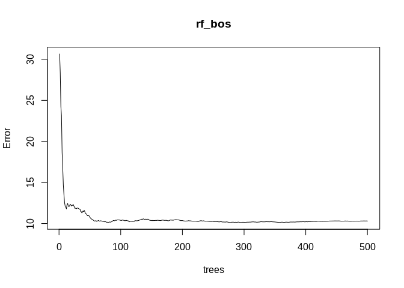
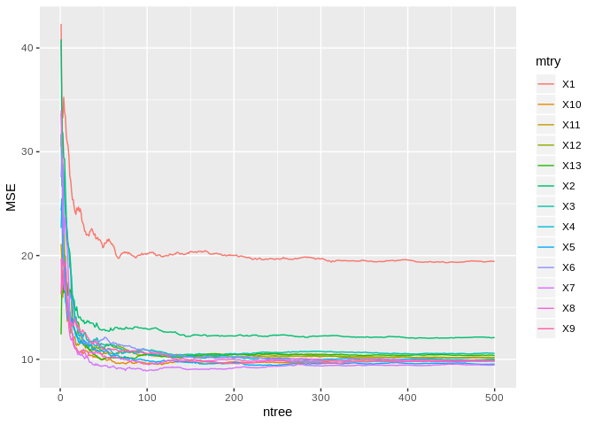

ch8\_exercises
================
Christoper Chan
January 6, 2019

``` r
library(tidyverse)
library(gbm)
library(randomForest)
library(ISLR)
library(MASS)
```

Applied
-------

### 7

``` r
rf_bos <- randomForest(medv~., Boston, ntree=500, mtry=13, importance=T)
plot(rf_bos)
```



So I tried for a good 45 minutes to do this in a for loop and as a function but no luck. The output of randomForest can't be stored in a data.frame.

TO DO: Create training and test dataset. Create different mtry, m=p, m=p/2, m=sqrt(p)

FINALLY! I did it with a for loop. My mistake before was i was putting the mse df in the for loop so the df was being reset each time.

``` r
tries <- 500

mse <- data.frame(matrix(NA, nrow=tries, ncol=13))
for (i in 1:13){
    a <- randomForest(medv~., Boston, ntree=tries, mtry=i, importance=T)
    mse[i] <- a$mse
}

mse$ntree <- 1:tries
head(mse)
```

    ##         X1       X2       X3       X4       X5       X6       X7       X8
    ## 1 42.32633 40.82609 31.67636 22.65098 24.31935 27.56375 33.98095 19.68960
    ## 2 33.49513 32.09343 26.66919 25.48647 25.44164 29.66825 30.05285 16.67828
    ## 3 33.27780 31.73664 28.72119 23.27853 19.16801 22.87034 28.54448 17.18458
    ## 4 35.24469 29.41262 28.02290 19.28510 20.00139 18.97133 22.04812 18.64893
    ## 5 33.78076 29.30297 25.15037 18.81083 18.70354 16.64035 23.67574 16.81549
    ## 6 33.37191 26.29239 23.96572 17.26571 15.58780 17.01894 22.71426 16.77705
    ##         X9      X10      X11      X12      X13 ntree
    ## 1 16.26842 30.49106 21.12034 33.67282 12.40003     1
    ## 2 19.69358 34.02152 18.97160 31.97064 18.08671     2
    ## 3 19.17191 25.04710 15.98070 26.12923 17.28112     3
    ## 4 19.01576 22.25504 18.57428 22.89227 16.39696     4
    ## 5 19.00369 19.29042 18.51711 20.04980 16.71555     5
    ## 6 19.34383 16.84488 17.24681 19.92728 17.14615     6

Creates a graph of MSE for each mtry.

``` r
long <- gather(mse, mtry, value, -ntree)
head(long)
```

    ##   ntree mtry    value
    ## 1     1   X1 42.32633
    ## 2     2   X1 33.49513
    ## 3     3   X1 33.27780
    ## 4     4   X1 35.24469
    ## 5     5   X1 33.78076
    ## 6     6   X1 33.37191

``` r
ggplot(long, aes(ntree, value, color=mtry)) +
    geom_line() +
    ylab('MSE')
```



df conversion done with the reshape2 package.

``` r
library(reshape2)
```

    ## 
    ## Attaching package: 'reshape2'

    ## The following object is masked from 'package:tidyr':
    ## 
    ##     smiths

``` r
df <- melt(mse, id.vars='ntree', variable.names='mtry')

View(df)

ggplot(df, aes(ntree, value)) +
    geom_line(aes(color=variable))
```


