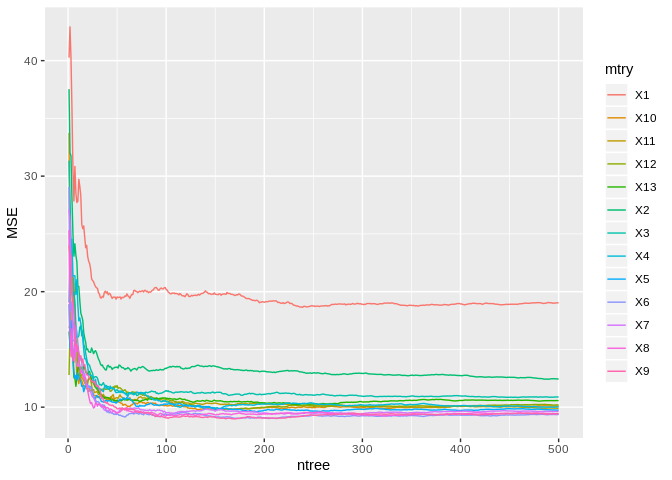
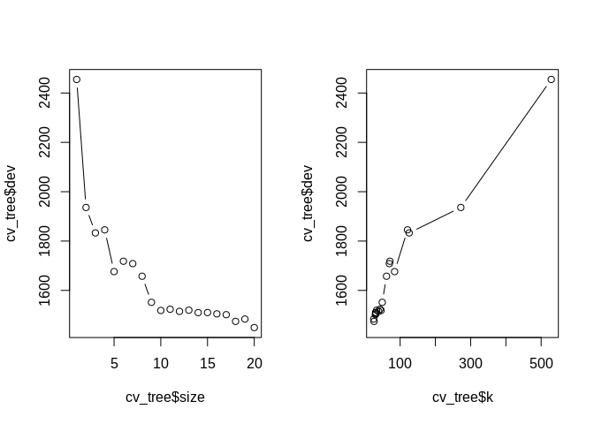

ch8\_exercises
================
Christoper Chan
January 6, 2019

``` r
library(tidyverse)
library(gbm)
library(tree)
library(randomForest)
library(ISLR)
library(MASS)
```

MSE function

``` r
MSE <- function(x,y){
    mean((x - y)^2)
}
```

Applied
-------

### 7

``` r
rf_bos <- randomForest(medv~., Boston, ntree=500, mtry=13, importance=T)
plot(rf_bos)
```


So I tried for a good 45 minutes to do this in a for loop and as a function but no luck. The output of randomForest can't be stored in a data.frame.

TO DO: Create training and test dataset. Create different mtry, m=p, m=p/2, m=sqrt(p)

FINALLY! I did it with a for loop. My mistake before was i was putting the mse df in the for loop so the df was being reset each time.

``` r
tries <- 500

mse <- data.frame(matrix(NA, nrow=tries, ncol=13))
for (i in 1:13){
    a <- randomForest(medv~., Boston, ntree=tries, mtry=i, importance=T)
    mse[i] <- a$mse
}

mse$ntree <- 1:tries
head(mse)
```

    ##         X1       X2       X3       X4       X5       X6       X7       X8
    ## 1 36.08010 22.21716 32.24358 26.76058 20.36838 28.41071 29.67609 44.06631
    ## 2 40.55937 23.68551 30.32068 26.24358 19.84917 30.33815 29.78690 35.05987
    ## 3 36.66617 25.94510 24.83410 24.61647 18.71518 25.52050 25.90266 24.83916
    ## 4 32.51219 21.91799 21.40587 24.26592 18.23135 20.78432 23.50674 21.77882
    ## 5 31.42277 21.42133 19.23304 20.73733 17.89434 19.33004 19.55081 20.13699
    ## 6 30.83123 21.72616 17.96058 22.81023 14.77458 19.33904 17.79737 19.13584
    ##         X9      X10      X11      X12      X13 ntree
    ## 1 18.00021 24.94677 17.69110 15.39390 31.13507     1
    ## 2 17.69751 25.07534 14.95798 19.29329 26.55970     2
    ## 3 17.92674 21.50085 20.99566 18.84270 26.70107     3
    ## 4 17.42712 18.95408 19.41554 20.18056 23.43456     4
    ## 5 18.36787 16.29642 19.98666 18.77554 19.98855     5
    ## 6 16.34018 15.85007 21.56573 18.45032 19.62783     6

Creates a graph of MSE for each mtry.

``` r
long <- gather(mse, mtry, value, -ntree)
head(long)
```

    ##   ntree mtry    value
    ## 1     1   X1 36.08010
    ## 2     2   X1 40.55937
    ## 3     3   X1 36.66617
    ## 4     4   X1 32.51219
    ## 5     5   X1 31.42277
    ## 6     6   X1 30.83123

``` r
ggplot(long, aes(ntree, value, color=mtry)) +
    geom_line() +
    ylab('MSE')
```

 MSE seems lo level off after 150 trees. X1 has the highest MSE of the mtry while X9 has the lowest minimum MSE.

df conversion done with the reshape2 package.

``` r
library(reshape2)
```

    ## Warning: package 'reshape2' was built under R version 3.4.4

    ## 
    ## Attaching package: 'reshape2'

    ## The following object is masked from 'package:tidyr':
    ## 
    ##     smiths

``` r
df <- melt(mse, id.vars='ntree', variable.names='mtry')

View(df)

ggplot(df, aes(ntree, value)) +
    geom_line(aes(color=variable))
```


### 8

1.  Training data is 3/4 of the Carseats data.

``` r
set.seed(5)

train <- sample(1:nrow(Carseats), (3/4)*nrow(Carseats))
test <- slice(Carseats, -train)
```

    ## Warning: package 'bindrcpp' was built under R version 3.4.4

``` r
train <- Carseats[train,]
```

1.  

``` r
reg_tree <- tree(Sales~., train)
summary(reg_tree)
```

    ## 
    ## Regression tree:
    ## tree(formula = Sales ~ ., data = train)
    ## Variables actually used in tree construction:
    ## [1] "ShelveLoc"   "Price"       "Age"         "Advertising" "CompPrice"  
    ## [6] "Population"  "Income"     
    ## Number of terminal nodes:  20 
    ## Residual mean deviance:  2.524 = 706.6 / 280 
    ## Distribution of residuals:
    ##    Min. 1st Qu.  Median    Mean 3rd Qu.    Max. 
    ## -3.9850 -0.9850 -0.0560  0.0000  0.9744  5.0090

Plot of tree

``` r
plot(reg_tree)
text(reg_tree, cex=0.8, pretty=0)
```


MSE is around 4.57.

``` r
pred_carseats <- predict(reg_tree, test)
MSE(pred_carseats, test$Sales)
```

    ## [1] 4.573537

1.  Looks like the best tree size is 9.

``` r
set.seed(10)

cv_tree <- cv.tree(reg_tree, FUN=prune.tree)
cv_tree
```

    ## $size
    ##  [1] 20 19 18 17 16 15 14 13 12 11 10  9  8  7  6  5  4  3  2  1
    ## 
    ## $dev
    ##  [1] 1449.207 1483.818 1474.311 1501.462 1504.789 1510.086 1509.923
    ##  [8] 1519.623 1514.920 1523.643 1518.617 1551.506 1657.301 1708.545
    ## [15] 1718.140 1676.093 1845.327 1832.987 1936.100 2455.037
    ## 
    ## $k
    ##  [1]      -Inf  24.97477  26.02050  29.80899  30.42954  30.46967  30.78367
    ##  [8]  33.22207  39.05502  42.75892  45.93394  49.27407  61.42385  69.35358
    ## [15]  71.05762  84.24680 120.97760 125.57046 272.16709 528.71924
    ## 
    ## $method
    ## [1] "deviance"
    ## 
    ## attr(,"class")
    ## [1] "prune"         "tree.sequence"

``` r
par(mfrow=c(1,2))
plot(cv_tree$size, cv_tree$dev, type='b')
plot(cv_tree$k, cv_tree$dev, type='b')
```



Running prune.tree with best=9

``` r
pruned <- prune.tree(reg_tree, best=9)

plot(pruned)
text(pruned, pretty=0)
```


Calculating MSE of pruned tree. We get a MSE of 3.74, which is roughly 0.8 lower than a reg tree. Pruning the tree does decrease the MSE.

``` r
pred_pruned <- predict(pruned, test)
MSE(pred_pruned, test$Sales)
```

    ## [1] 3.740164

1.  So I just need to remeber that I need to use the randomForest() where mtry = *p* in order to only do bagging.

``` r
set.seed(1)

bag_car <- randomForest(Sales~., train, mtry=10, importance=TRUE)
bag_car
```

    ## 
    ## Call:
    ##  randomForest(formula = Sales ~ ., data = train, mtry = 10, importance = TRUE) 
    ##                Type of random forest: regression
    ##                      Number of trees: 500
    ## No. of variables tried at each split: 10
    ## 
    ##           Mean of squared residuals: 2.651691
    ##                     % Var explained: 67.17

``` r
importance(bag_car)
```

    ##                %IncMSE IncNodePurity
    ## CompPrice   31.5102047    258.198822
    ## Income       5.7282685    111.437402
    ## Advertising 23.1289063    215.273668
    ## Population   0.1408167     85.478719
    ## Price       61.3567059    720.401178
    ## ShelveLoc   73.1567053    626.649235
    ## Age         24.5676254    247.593006
    ## Education    4.3458187     66.635900
    ## Urban       -1.4207142      9.113515
    ## US           4.4489013     19.060855

We get a test MSE of 1.93. Which is lower than the training MSE of 2.65. Price, ShelveLoc & CompPrice are the most importance variables.

``` r
pred_bag <- predict(bag_car, test)

MSE(pred_bag, test$Sales)
```

    ## [1] 1.932099

1.  

``` r
set.seed(2)

rf_car2 <- randomForest(Sales~., train, mtry=5, importance=T)
rf_car2
```

    ## 
    ## Call:
    ##  randomForest(formula = Sales ~ ., data = train, mtry = 5, importance = T) 
    ##                Type of random forest: regression
    ##                      Number of trees: 500
    ## No. of variables tried at each split: 5
    ## 
    ##           Mean of squared residuals: 2.77816
    ##                     % Var explained: 65.6

``` r
importance(rf_car2)
```

    ##                %IncMSE IncNodePurity
    ## CompPrice   18.4376338     226.57808
    ## Income       4.6196814     149.26851
    ## Advertising 19.3707023     236.91850
    ## Population  -0.2817878     121.65108
    ## Price       52.2657149     625.61383
    ## ShelveLoc   52.0158350     579.80128
    ## Age         18.0713290     265.59039
    ## Education    2.4538607      88.34015
    ## Urban       -1.4711313      13.41200
    ## US           5.6914764      30.39115

``` r
pred_rf2 <- predict(rf_car2, test)
MSE(pred_rf2, test$Sales)
```

    ## [1] 2.045975

``` r
rf_carsqrt <- randomForest(Sales~., train, mtry=sqrt(10), importance=T)

rf_carsqrt
```

    ## 
    ## Call:
    ##  randomForest(formula = Sales ~ ., data = train, mtry = sqrt(10),      importance = T) 
    ##                Type of random forest: regression
    ##                      Number of trees: 500
    ## No. of variables tried at each split: 3
    ## 
    ##           Mean of squared residuals: 3.143607
    ##                     % Var explained: 61.08

``` r
importance(rf_carsqrt)
```

    ##               %IncMSE IncNodePurity
    ## CompPrice   13.183026     212.86668
    ## Income       3.344561     176.86179
    ## Advertising 15.045662     227.23708
    ## Population  -1.460400     159.40722
    ## Price       41.936327     546.49453
    ## ShelveLoc   46.626280     499.43002
    ## Age         16.641022     291.16673
    ## Education    2.783632     108.93297
    ## Urban       -3.153515      19.12951
    ## US           5.871049      43.48906

Random forest was run twice, once with mtry=*p*/2 and again with mtry=$\\sqrt{p}$. The MSE of *p*/2 is 2.05 and the MSE of $\\sqrt{p}$ is 2.46. Both are a increase in MSE over bagging. Both rf show very similar importance, with Price and Shelveloc being the most importance predictors for both, but then *p*/2 chooses CompPrice as the third most important predictor while *s**q**r**t**p* chooses Age.

``` r
pred_rfsqrt <- predict(rf_carsqrt, test)
MSE(pred_rfsqrt, test$Sales)
```

    ## [1] 2.455962

### 9

1.  Training dataset of 800 observations

``` r
set.seed(20)

train <- sample(nrow(OJ), 800)
test <- slice(OJ, -train)
train <- OJ[train,]
```

1.  We get 9 terminal nodes. The tree is built from only 4 varibles: LoyalCH, PriceDiff, DiscMM, Store7. The training error rate is 0.1588.

``` r
oj_tree <- tree(Purchase~., train)
summary(oj_tree)
```

    ## 
    ## Classification tree:
    ## tree(formula = Purchase ~ ., data = train)
    ## Variables actually used in tree construction:
    ## [1] "LoyalCH"   "PriceDiff" "DiscMM"    "Store7"   
    ## Number of terminal nodes:  9 
    ## Residual mean deviance:  0.7368 = 582.8 / 791 
    ## Misclassification error rate: 0.1588 = 127 / 800

``` r
plot(oj_tree)
text(oj_tree, pretty=0)
```


1.  Node 10, which is a terminal node, classifies a MM. If the price difference is less than $0.17 than customer will pick MM over CH. In this case, 56 customers are in this terminal node with a deviance of 58.19. 21.43% of Purchase have CH as the value while remaining 78.57% of Purchase have the value MM.

``` r
oj_tree
```

    ## node), split, n, deviance, yval, (yprob)
    ##       * denotes terminal node
    ## 
    ##  1) root 800 1063.00 CH ( 0.61875 0.38125 )  
    ##    2) LoyalCH < 0.5036 338  401.50 MM ( 0.28107 0.71893 )  
    ##      4) LoyalCH < 0.32192 190  158.90 MM ( 0.14737 0.85263 )  
    ##        8) LoyalCH < 0.051325 61   10.21 MM ( 0.01639 0.98361 ) *
    ##        9) LoyalCH > 0.051325 129  132.40 MM ( 0.20930 0.79070 ) *
    ##      5) LoyalCH > 0.32192 148  203.80 MM ( 0.45270 0.54730 )  
    ##       10) PriceDiff < 0.17 56   58.19 MM ( 0.21429 0.78571 ) *
    ##       11) PriceDiff > 0.17 92  124.00 CH ( 0.59783 0.40217 ) *
    ##    3) LoyalCH > 0.5036 462  364.30 CH ( 0.86580 0.13420 )  
    ##      6) LoyalCH < 0.764572 197  227.40 CH ( 0.73604 0.26396 )  
    ##       12) PriceDiff < 0.05 72   99.81 MM ( 0.50000 0.50000 )  
    ##         24) DiscMM < 0.47 54   72.17 CH ( 0.61111 0.38889 ) *
    ##         25) DiscMM > 0.47 18   16.22 MM ( 0.16667 0.83333 ) *
    ##       13) PriceDiff > 0.05 125   95.64 CH ( 0.87200 0.12800 ) *
    ##      7) LoyalCH > 0.764572 265   85.16 CH ( 0.96226 0.03774 )  
    ##       14) Store7: No 154   74.02 CH ( 0.93506 0.06494 ) *
    ##       15) Store7: Yes 111    0.00 CH ( 1.00000 0.00000 ) *

1.  See (a)
2.  The test error is `{r}(132+85)/(132+27+26+85)`

``` r
oj_tpred <- predict(oj_tree, test, type='class')

table(oj_tpred, test$Purchase)
```

    ##         
    ## oj_tpred  CH  MM
    ##       CH 132  27
    ##       MM  26  85

1.  

``` r
oj_cv_tree <- cv.tree(oj_tree, FUN=prune.tree)
oj_cv_tree
```

    ## $size
    ## [1] 9 8 7 6 5 4 3 2 1
    ## 
    ## $dev
    ## [1]  688.7810  688.8420  688.8420  678.4876  699.9952  737.1975  741.3148
    ## [8]  771.7294 1063.7042
    ## 
    ## $k
    ## [1]      -Inf  11.13723  11.42215  16.31726  21.65779  31.94519  38.78481
    ## [8]  51.76482 297.63618
    ## 
    ## $method
    ## [1] "deviance"
    ## 
    ## attr(,"class")
    ## [1] "prune"         "tree.sequence"

1.  Tree with size 6 has the lowest deviation

``` r
attach(oj_cv_tree)

plot(size, dev, type='b')
```


1.  See (g)
2.  

``` r
oj_prune <- prune.tree(oj_tree, best=6)

summary(oj_prune)
```

    ## 
    ## Classification tree:
    ## snip.tree(tree = oj_tree, nodes = c(7L, 12L, 4L))
    ## Variables actually used in tree construction:
    ## [1] "LoyalCH"   "PriceDiff"
    ## Number of terminal nodes:  6 
    ## Residual mean deviance:  0.783 = 621.7 / 794 
    ## Misclassification error rate: 0.1737 = 139 / 800

``` r
plot(oj_prune)
text(oj_prune, pretty=0)
```


1.  The training error for the unpruned tree is: 0.1588. The training error for the pruned tree is: 0.1737. Based on the training error the unpruned tree preforms better.

2.  The test error for unpruned is: 0.197, while the test error for pruned tree is 0.222. The pruned tree has a higher test error.

``` r
oj_ppred <- predict(oj_prune, test, type='class')

table(oj_ppred, test$Purchase)
```

    ##         
    ## oj_ppred  CH  MM
    ##       CH 126  28
    ##       MM  32  84
