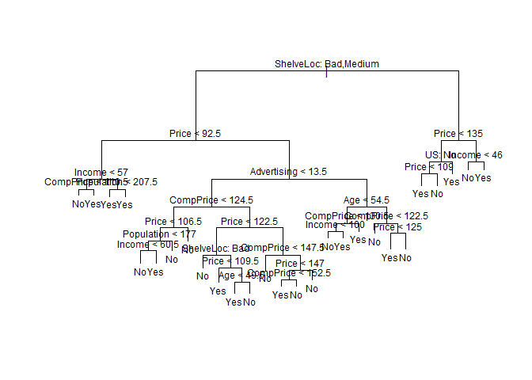
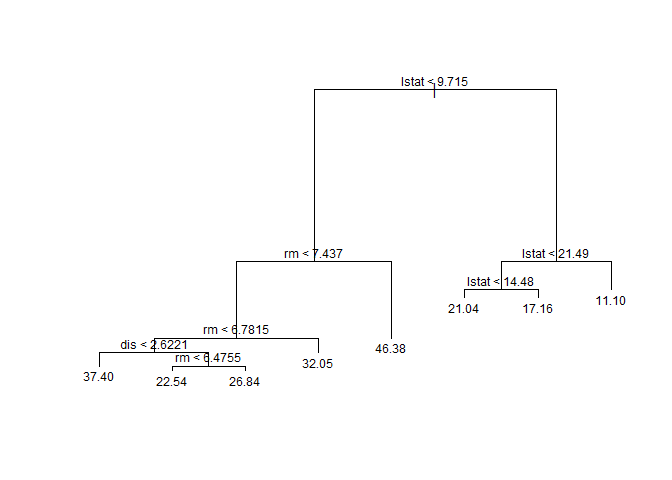
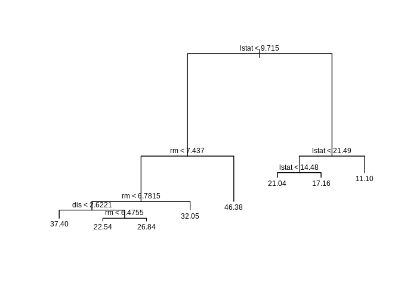
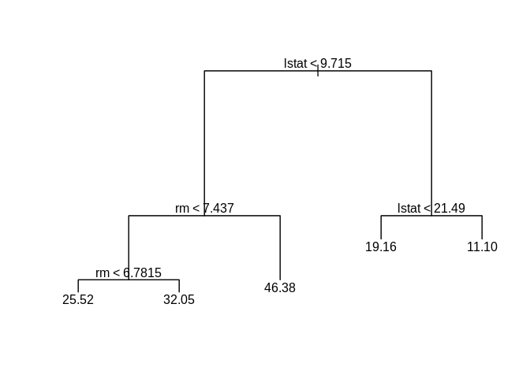

ch8\_labs
================
Christopher Chan
December 19, 2018

``` r
library(tidyverse)
library(tree)
library(ISLR)
library(randomForest)
```

8.3.1
-----

Preview Carseats data.

``` r
head(Carseats)
```

    ##   Sales CompPrice Income Advertising Population Price ShelveLoc Age
    ## 1  9.50       138     73          11        276   120       Bad  42
    ## 2 11.22       111     48          16        260    83      Good  65
    ## 3 10.06       113     35          10        269    80    Medium  59
    ## 4  7.40       117    100           4        466    97    Medium  55
    ## 5  4.15       141     64           3        340   128       Bad  38
    ## 6 10.81       124    113          13        501    72       Bad  78
    ##   Education Urban  US
    ## 1        17   Yes Yes
    ## 2        10   Yes Yes
    ## 3        12   Yes Yes
    ## 4        14   Yes Yes
    ## 5        13   Yes  No
    ## 6        16    No Yes

``` r
attach(Carseats)
```

Create predictor High and add to Carseats. Needed to set the created predictor High to a factor, originally it was created as a chr

``` r
High <- as.factor(ifelse(Sales<=8, 'No', 'Yes'))

Carseats_high <- Carseats %>%
    mutate(High)
head(Carseats_high)
```

    ##   Sales CompPrice Income Advertising Population Price ShelveLoc Age
    ## 1  9.50       138     73          11        276   120       Bad  42
    ## 2 11.22       111     48          16        260    83      Good  65
    ## 3 10.06       113     35          10        269    80    Medium  59
    ## 4  7.40       117    100           4        466    97    Medium  55
    ## 5  4.15       141     64           3        340   128       Bad  38
    ## 6 10.81       124    113          13        501    72       Bad  78
    ##   Education Urban  US High
    ## 1        17   Yes Yes  Yes
    ## 2        10   Yes Yes  Yes
    ## 3        12   Yes Yes  Yes
    ## 4        14   Yes Yes   No
    ## 5        13   Yes  No   No
    ## 6        16    No Yes  Yes

``` r
dim(Carseats_high)
```

    ## [1] 400  12

``` r
carseats_tree <- tree(High~.-Sales, Carseats_high)
summary(carseats_tree)
```

    ## 
    ## Classification tree:
    ## tree(formula = High ~ . - Sales, data = Carseats_high)
    ## Variables actually used in tree construction:
    ## [1] "ShelveLoc"   "Price"       "Income"      "CompPrice"   "Population" 
    ## [6] "Advertising" "Age"         "US"         
    ## Number of terminal nodes:  27 
    ## Residual mean deviance:  0.4575 = 170.7 / 373 
    ## Misclassification error rate: 0.09 = 36 / 400

``` r
plot(carseats_tree)
text(carseats_tree, cex=0.75, pretty=0)
```



``` r
set.seed(2)
train <- sample(1:nrow(Carseats), 200)
Carseats_test <- Carseats_high[-train,]
dim(Carseats_test)
```

    ## [1] 200  12

``` r
High_test <- High[-train]

carseats_tree <- tree(High~.-Sales, Carseats_high, subset=train)
tree_pred <- predict(carseats_tree, Carseats_test, type='class')
table(tree_pred, High_test)
```

    ##          High_test
    ## tree_pred No Yes
    ##       No  86  27
    ##       Yes 30  57

``` r
(87+59)/200 #Accuracy
```

    ## [1] 0.73

``` r
set.seed(3)
cv_carseats <- cv.tree(carseats_tree, FUN=prune.misclass)
names(cv_carseats)
```

    ## [1] "size"   "dev"    "k"      "method"

``` r
cv_carseats
```

    ## $size
    ## [1] 19 17 14 13  9  7  3  2  1
    ## 
    ## $dev
    ## [1] 55 55 53 52 50 56 69 65 80
    ## 
    ## $k
    ## [1]       -Inf  0.0000000  0.6666667  1.0000000  1.7500000  2.0000000
    ## [7]  4.2500000  5.0000000 23.0000000
    ## 
    ## $method
    ## [1] "misclass"
    ## 
    ## attr(,"class")
    ## [1] "prune"         "tree.sequence"

``` r
par(mfrow=c(1,2))
plot(cv_carseats$size, cv_carseats$dev, type='b')
plot(cv_carseats$k, cv_carseats$dev, type='b')
```


``` r
prune_carseats <- prune.misclass(carseats_tree, best = 9)
plot(prune_carseats)
text(prune_carseats, pretty=0)
```


``` r
prune_pred <- predict(prune_carseats, Carseats_test, type='class')
table(prune_pred, High_test)
```

    ##           High_test
    ## prune_pred No Yes
    ##        No  94  24
    ##        Yes 22  60

``` r
(101+74)/200 #accuracy
```

    ## [1] 0.875

8.3.2
-----

``` r
library(MASS)
```

    ## Warning: package 'MASS' was built under R version 3.4.4

``` r
set.seed(1)

train <- sample(1:nrow(Boston), nrow(Boston)/2)
tree_bos <- tree(medv~., Boston, subset=train)
summary(tree_bos)
```

    ## 
    ## Regression tree:
    ## tree(formula = medv ~ ., data = Boston, subset = train)
    ## Variables actually used in tree construction:
    ## [1] "lstat" "rm"    "dis"  
    ## Number of terminal nodes:  8 
    ## Residual mean deviance:  12.65 = 3099 / 245 
    ## Distribution of residuals:
    ##      Min.   1st Qu.    Median      Mean   3rd Qu.      Max. 
    ## -14.10000  -2.04200  -0.05357   0.00000   1.96000  12.60000

``` r
plot(tree_bos)
text(tree_bos, pretty=0, cex=0.75)
```



``` r
cv_bos <- cv.tree(tree_bos)
plot(cv_bos$size, cv_bos$dev, type='b')
```



``` r
prune_bos <- prune.tree(tree_bos, best=5)
plot(prune_bos)
text(prune_bos, pretty=0)
```


``` r
yhat <- predict(tree_bos, newdata=Boston[-train,])
test_bos <- Boston[-train, 'medv'] 

plot(yhat, test_bos)
abline(0, 1)
```



``` r
mean((yhat-test_bos)^2)
```

    ## [1] 25.04559

8.3.3
-----

``` r
set.seed(1)

bag_boston <- randomForest(medv~., Boston, subset=train, mtry=13, importance=T)
bag_boston
```

    ## 
    ## Call:
    ##  randomForest(formula = medv ~ ., data = Boston, mtry = 13, importance = T,      subset = train) 
    ##                Type of random forest: regression
    ##                      Number of trees: 500
    ## No. of variables tried at each split: 13
    ## 
    ##           Mean of squared residuals: 11.15723
    ##                     % Var explained: 86.49

Accuracy of model

``` r
yhat_bag <- predict(bag_boston, newdata=Boston[-train,])

plot(yhat_bag, test_bos)
abline(0,1)
```


``` r
mean((yhat_bag - test_bos)^2)
```

    ## [1] 13.50808
