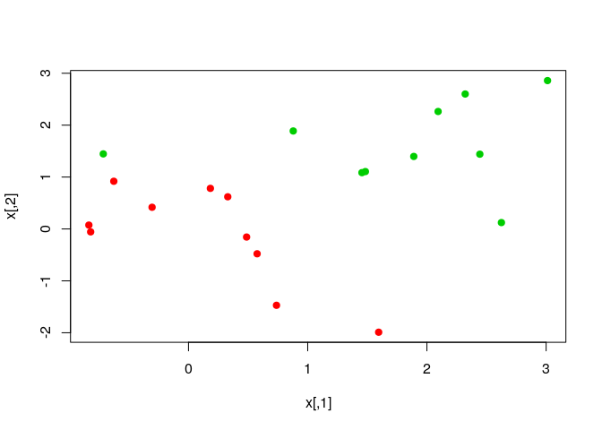

ch9\_lab
================
Christoper Chan
March 1, 2019

``` r
library(tidyverse)
library(e1071)
library(caret)
```

### 9.6.1

Setting up our randomly generated data.

``` r
set.seed(1)

x <- matrix(rnorm(20*2), ncol=2)
y <- c(rep(-1, 10), rep(1, 10))

x[y==1,] <- x[y==1,] + 1
plot(x, col=(3-y))
```


Creating a dataframe from our data and running a SVM on it.

``` r
df <- data.frame(x=x, y=as.factor(y))

svm_fit <- svm(y~., df, kernel='linear', cost=10, scale=FALSE)
summary(svm_fit)
```

    ## 
    ## Call:
    ## svm(formula = y ~ ., data = df, kernel = "linear", cost = 10, 
    ##     scale = FALSE)
    ## 
    ## 
    ## Parameters:
    ##    SVM-Type:  C-classification 
    ##  SVM-Kernel:  linear 
    ##        cost:  10 
    ##       gamma:  0.5 
    ## 
    ## Number of Support Vectors:  7
    ## 
    ##  ( 4 3 )
    ## 
    ## 
    ## Number of Classes:  2 
    ## 
    ## Levels: 
    ##  -1 1

``` r
plot(svm_fit, df)
```


Observations in the margins.

``` r
svm_fit$index
```

    ## [1]  1  2  5  7 14 16 17

Running SVM again with a smaller cost parameter.

``` r
svm_fit_lc <- svm(y~., df, kernel='linear', cost=0.1, scale=FALSE)

summary(svm_fit_lc)
```

    ## 
    ## Call:
    ## svm(formula = y ~ ., data = df, kernel = "linear", cost = 0.1, 
    ##     scale = FALSE)
    ## 
    ## 
    ## Parameters:
    ##    SVM-Type:  C-classification 
    ##  SVM-Kernel:  linear 
    ##        cost:  0.1 
    ##       gamma:  0.5 
    ## 
    ## Number of Support Vectors:  16
    ## 
    ##  ( 8 8 )
    ## 
    ## 
    ## Number of Classes:  2 
    ## 
    ## Levels: 
    ##  -1 1

``` r
plot(svm_fit_lc, df)
```


tune() preforms 10 fold CV on a model.

``` r
set.seed(1)

tune_svm <- tune(svm, y~., data=df, kernel='linear', ranges=list(cost=c(0.001, 0.01, 0.1, 1, 5, 10, 100)))

summary(tune_svm)
```

    ## 
    ## Parameter tuning of 'svm':
    ## 
    ## - sampling method: 10-fold cross validation 
    ## 
    ## - best parameters:
    ##  cost
    ##   0.1
    ## 
    ## - best performance: 0.1 
    ## 
    ## - Detailed performance results:
    ##    cost error dispersion
    ## 1 1e-03  0.70  0.4216370
    ## 2 1e-02  0.70  0.4216370
    ## 3 1e-01  0.10  0.2108185
    ## 4 1e+00  0.15  0.2415229
    ## 5 5e+00  0.15  0.2415229
    ## 6 1e+01  0.15  0.2415229
    ## 7 1e+02  0.15  0.2415229

tune() stores the model with the lowest error in a variable called best.model

``` r
best_model <- tune_svm$best.model
summary(best_model)
```

    ## 
    ## Call:
    ## best.tune(method = svm, train.x = y ~ ., data = df, ranges = list(cost = c(0.001, 
    ##     0.01, 0.1, 1, 5, 10, 100)), kernel = "linear")
    ## 
    ## 
    ## Parameters:
    ##    SVM-Type:  C-classification 
    ##  SVM-Kernel:  linear 
    ##        cost:  0.1 
    ##       gamma:  0.5 
    ## 
    ## Number of Support Vectors:  16
    ## 
    ##  ( 8 8 )
    ## 
    ## 
    ## Number of Classes:  2 
    ## 
    ## Levels: 
    ##  -1 1

Testing the accuracy of our SVC model

``` r
x_test <- matrix(rnorm(20*2), ncol=2)
y_test <- sample(c(-1,1), 20, rep=TRUE)
x_test[y_test==1,] <- x_test[y_test==1,] + 1
test_data <- data.frame(x=x_test, y=as.factor(y_test))
```

``` r
y_pred <- predict(best_model, test_data)

confusionMatrix(y_pred, test_data$y)
```

    ## Confusion Matrix and Statistics
    ## 
    ##           Reference
    ## Prediction -1  1
    ##         -1 11  1
    ##         1   0  8
    ##                                           
    ##                Accuracy : 0.95            
    ##                  95% CI : (0.7513, 0.9987)
    ##     No Information Rate : 0.55            
    ##     P-Value [Acc > NIR] : 0.0001114       
    ##                                           
    ##                   Kappa : 0.898           
    ##  Mcnemar's Test P-Value : 1.0000000       
    ##                                           
    ##             Sensitivity : 1.0000          
    ##             Specificity : 0.8889          
    ##          Pos Pred Value : 0.9167          
    ##          Neg Pred Value : 1.0000          
    ##              Prevalence : 0.5500          
    ##          Detection Rate : 0.5500          
    ##    Detection Prevalence : 0.6000          
    ##       Balanced Accuracy : 0.9444          
    ##                                           
    ##        'Positive' Class : -1              
    ## 

Running svm with cost=0.01. In this case it preforms far worse, with a accuracy of 0.7 and a much lower specificity.

``` r
svm_fit_0.01 <- svm(y~., df, kernel='linear', cost=0.01, scale=FALSE)

y_pred_0.01 <- predict(svm_fit_0.01, test_data)
confusionMatrix(y_pred_0.01, test_data$y)
```

    ## Confusion Matrix and Statistics
    ## 
    ##           Reference
    ## Prediction -1  1
    ##         -1 11  2
    ##         1   0  7
    ##                                          
    ##                Accuracy : 0.9            
    ##                  95% CI : (0.683, 0.9877)
    ##     No Information Rate : 0.55           
    ##     P-Value [Acc > NIR] : 0.0009274      
    ##                                          
    ##                   Kappa : 0.7938         
    ##  Mcnemar's Test P-Value : 0.4795001      
    ##                                          
    ##             Sensitivity : 1.0000         
    ##             Specificity : 0.7778         
    ##          Pos Pred Value : 0.8462         
    ##          Neg Pred Value : 1.0000         
    ##              Prevalence : 0.5500         
    ##          Detection Rate : 0.5500         
    ##    Detection Prevalence : 0.6500         
    ##       Balanced Accuracy : 0.8889         
    ##                                          
    ##        'Positive' Class : -1             
    ## 

Classes are linearlly seperable.

``` r
x[y==1,] <- x[y==1,]+0.5
plot(x, col=(y+5)/2, pch=19)
```



Creating a SVC that linearly seperates the 2 classes. Very few observations, 3, are used in creating the hyperplane. There is a very narrow margin, which means it might perform poorly on test data. Let's see.

``` r
df_linear <- data.frame(x=x, y=as.factor(y))

svm_fit_linear <- svm(y~., df_linear, kernel='linear', cost=1e5)

summary(svm_fit_linear)
```

    ## 
    ## Call:
    ## svm(formula = y ~ ., data = df_linear, kernel = "linear", cost = 1e+05)
    ## 
    ## 
    ## Parameters:
    ##    SVM-Type:  C-classification 
    ##  SVM-Kernel:  linear 
    ##        cost:  1e+05 
    ##       gamma:  0.5 
    ## 
    ## Number of Support Vectors:  3
    ## 
    ##  ( 1 2 )
    ## 
    ## 
    ## Number of Classes:  2 
    ## 
    ## Levels: 
    ##  -1 1

``` r
plot(svm_fit_linear, df_linear)
```


To generalize model above we'll use a much lower cost. This time 5 observations are used as support vectors and we have a much wider margin.

``` r
svm_fit_linear <- svm(y~., df_linear, kernel='linear', cost=1)
summary(svm_fit_linear)
```

    ## 
    ## Call:
    ## svm(formula = y ~ ., data = df_linear, kernel = "linear", cost = 1)
    ## 
    ## 
    ## Parameters:
    ##    SVM-Type:  C-classification 
    ##  SVM-Kernel:  linear 
    ##        cost:  1 
    ##       gamma:  0.5 
    ## 
    ## Number of Support Vectors:  7
    ## 
    ##  ( 4 3 )
    ## 
    ## 
    ## Number of Classes:  2 
    ## 
    ## Levels: 
    ##  -1 1

``` r
plot(svm_fit_linear, df_linear)
```


### 9.6.2

Non-linear data

``` r
set.seed(1)

x <- matrix(rnorm(200*2), ncol=2)
x[1:100,] <- x[1:100,]+2
x[101:150,] <- x[101:150,]-2
y <- c(rep(1,150), rep(2,50))

df <- data.frame(x=x, y=as.factor(y))
plot(x, col=y, pch=19)
```


Creating our radial SVM model

``` r
# Randomly sampling for obs that'll be our training dataset 
train <- sample(200, 100)

svm_fit <- svm(y~., df[train,], kernel='radial', gamma=1, cost=1)
plot(svm_fit, df[train,])
```


Using the same radial kernel, but greatly increasing the cost function. It provides a much more complex decision boundary and probably overfits the data.

``` r
svm_fit <- svm(y~., df[train,], kernel='radial', gamma=1, cost=1e5)

plot(svm_fit, df[train,])
```


Tuning the hyperparameters of cost and *γ* using tune, which performs soft-margin grid search of hyperparameter space. tune() gives the optimal hyperparameters as cost=1 and *γ* = 0.5.

``` r
set.seed(1)

tune_out <- tune(svm, y~., data=df[train,], kernel='radial', ranges=list(cost=c(0.1,1,10,100,1000), gamma=c(0.5,1,2,3,4)))
summary(tune_out)
```

    ## 
    ## Parameter tuning of 'svm':
    ## 
    ## - sampling method: 10-fold cross validation 
    ## 
    ## - best parameters:
    ##  cost gamma
    ##     1     2
    ## 
    ## - best performance: 0.12 
    ## 
    ## - Detailed performance results:
    ##     cost gamma error dispersion
    ## 1  1e-01   0.5  0.27 0.11595018
    ## 2  1e+00   0.5  0.13 0.08232726
    ## 3  1e+01   0.5  0.15 0.07071068
    ## 4  1e+02   0.5  0.17 0.08232726
    ## 5  1e+03   0.5  0.21 0.09944289
    ## 6  1e-01   1.0  0.25 0.13540064
    ## 7  1e+00   1.0  0.13 0.08232726
    ## 8  1e+01   1.0  0.16 0.06992059
    ## 9  1e+02   1.0  0.20 0.09428090
    ## 10 1e+03   1.0  0.20 0.08164966
    ## 11 1e-01   2.0  0.25 0.12692955
    ## 12 1e+00   2.0  0.12 0.09189366
    ## 13 1e+01   2.0  0.17 0.09486833
    ## 14 1e+02   2.0  0.19 0.09944289
    ## 15 1e+03   2.0  0.20 0.09428090
    ## 16 1e-01   3.0  0.27 0.11595018
    ## 17 1e+00   3.0  0.13 0.09486833
    ## 18 1e+01   3.0  0.18 0.10327956
    ## 19 1e+02   3.0  0.21 0.08755950
    ## 20 1e+03   3.0  0.22 0.10327956
    ## 21 1e-01   4.0  0.27 0.11595018
    ## 22 1e+00   4.0  0.15 0.10801234
    ## 23 1e+01   4.0  0.18 0.11352924
    ## 24 1e+02   4.0  0.21 0.08755950
    ## 25 1e+03   4.0  0.24 0.10749677

testing with optimal parameters. We had a accuracy of 88%, which isn't too bad.

``` r
predicted <- predict(tune_out$best.model, newdata=df[-train,])
confusionMatrix(predicted, df[-train, 'y'])
```

    ## Confusion Matrix and Statistics
    ## 
    ##           Reference
    ## Prediction  1  2
    ##          1 74  7
    ##          2  3 16
    ##                                          
    ##                Accuracy : 0.9            
    ##                  95% CI : (0.8238, 0.951)
    ##     No Information Rate : 0.77           
    ##     P-Value [Acc > NIR] : 0.0006692      
    ##                                          
    ##                   Kappa : 0.6993         
    ##  Mcnemar's Test P-Value : 0.3427817      
    ##                                          
    ##             Sensitivity : 0.9610         
    ##             Specificity : 0.6957         
    ##          Pos Pred Value : 0.9136         
    ##          Neg Pred Value : 0.8421         
    ##              Prevalence : 0.7700         
    ##          Detection Rate : 0.7400         
    ##    Detection Prevalence : 0.8100         
    ##       Balanced Accuracy : 0.8283         
    ##                                          
    ##        'Positive' Class : 1              
    ##
